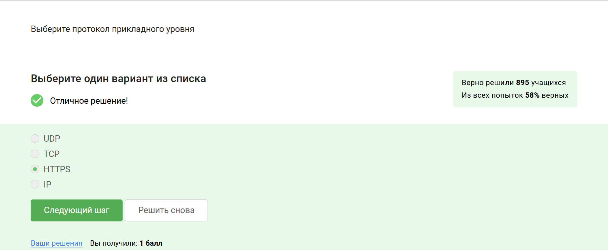
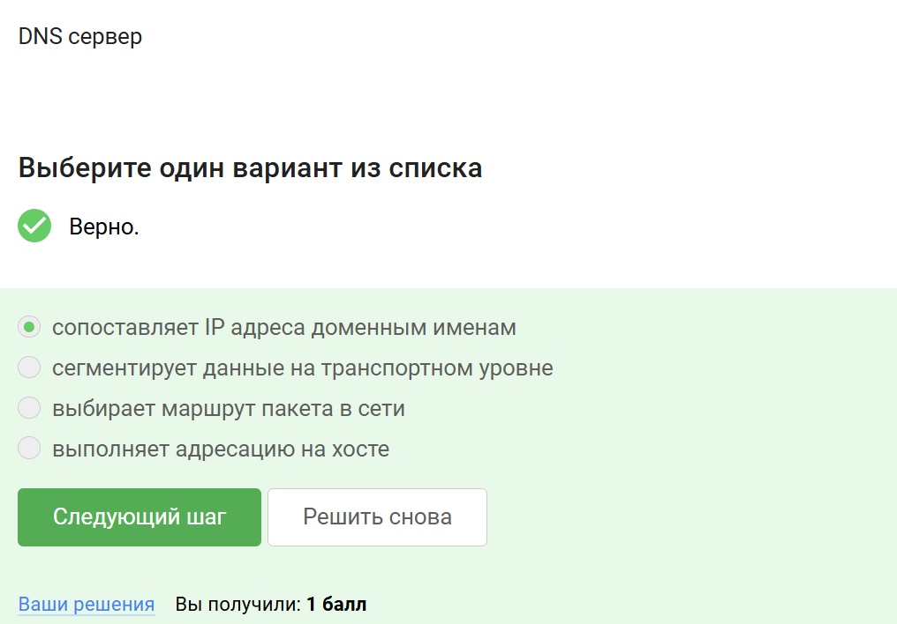
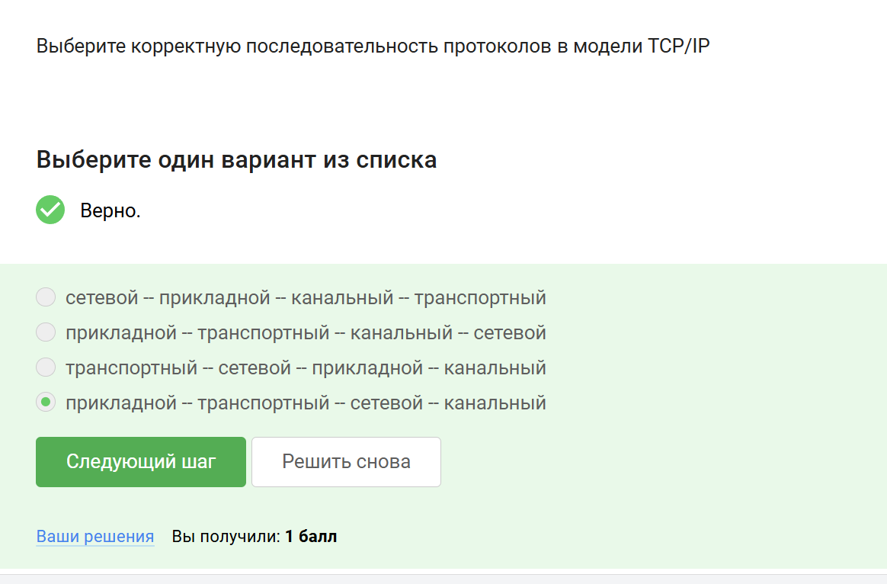
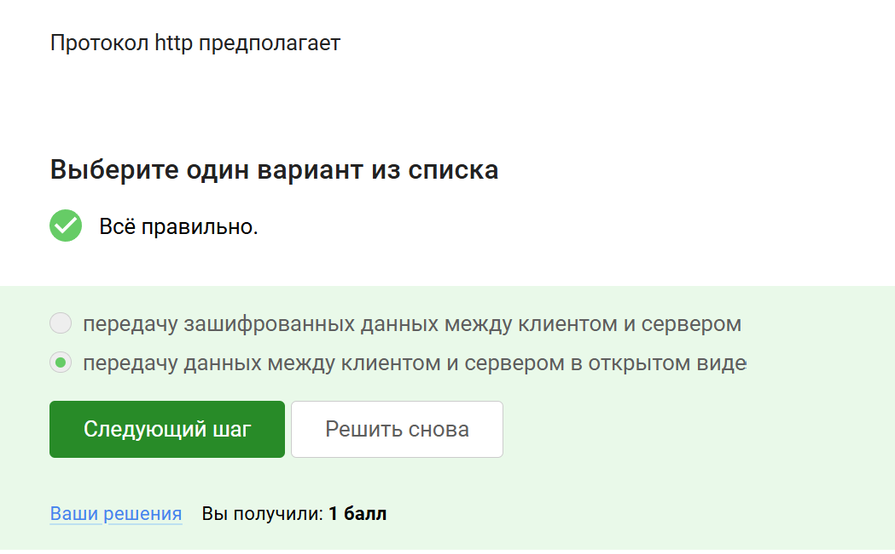
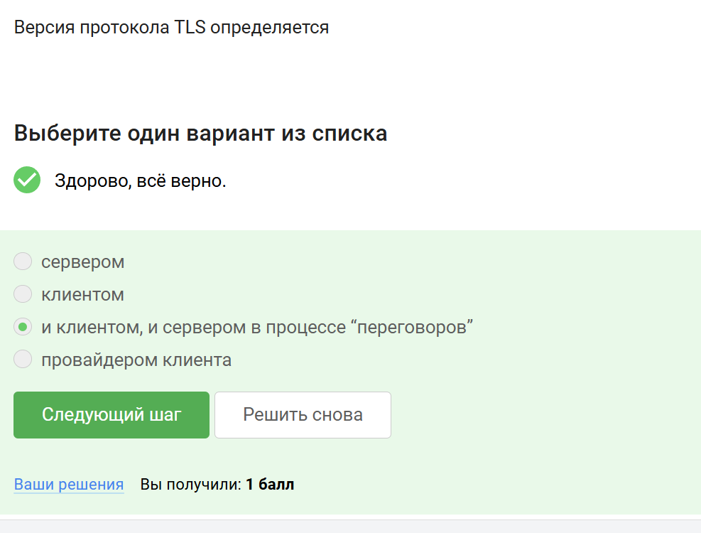
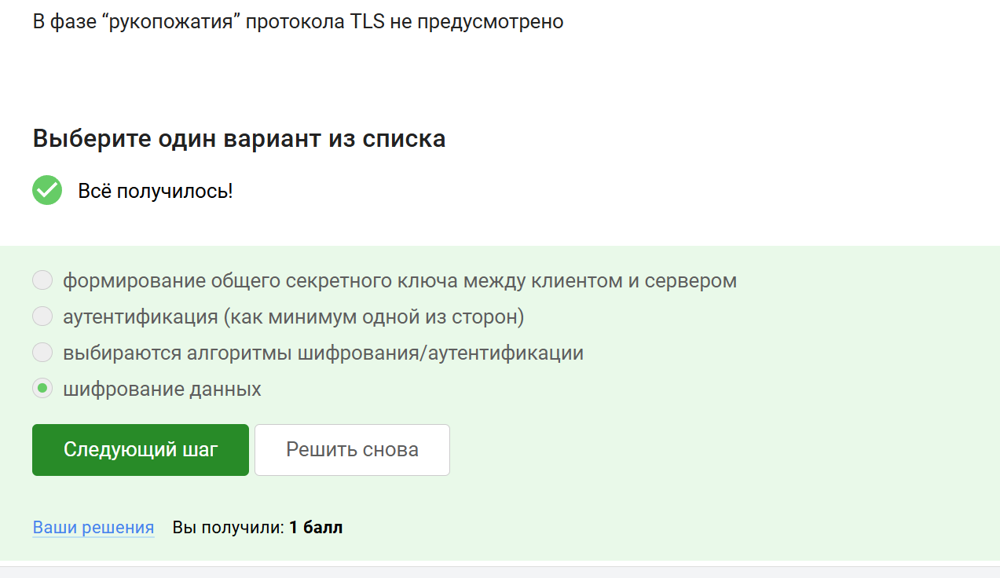

---
## Front matter
lang: ru-RU
title: Прохождение внешнего курса
subtitle: 1 часть
author:
  - Дагделен З. Р.
institute:
  - Российский университет дружбы народов, Москва, Россия
date: 10 мая 2025

## i18n babel
babel-lang: russian
babel-otherlangs: english

## Formatting pdf
toc: false
toc-title: Содержание
slide_level: 2
aspectratio: 169
section-titles: true
theme: metropolis
header-includes:
 - \metroset{progressbar=frametitle,sectionpage=progressbar,numbering=fraction}
---

## Докладчик

:::::::::::::: {.columns align=center}
::: {.column width="70%"}

  * Дагделен Зейнап Реджеповна
  * студентка из группы НКАбд-02-23
  * Факультет физико-математических и естественных наук
  * Российский университет дружбы народов
  * [1132236052@rudn.ru](mailto:1132236052@rudn.ru)

:::
::: {.column width="50%"}

:::
::::::::::::::

## Выполнение заданий

Так как заданий много, покажу лишь часть.

## Протокол прикладного уровня
**Комментарий:** HTTPS — это протокол прикладного уровня, обеспечивающий безопасную передачу данных .  

{#fig:001 width=70%}

##  Уровень работы протокола TCP
**Комментарий:** TCP работает на транспортном уровне модели OSI.

{#fig:002 width=70%}

##  Корректные адреса IPv4
**Комментарий:** Примеры корректных IPv4-адресов: `90.11.90.22` и `25.198.0.15`.  

{#fig:003 width=70%}

##  Функция DNS сервера
**Комментарий:** DNS сервер сопоставляет доменные имена с IP-адресами(рис. [-@fig:004]). 
 
{#fig:004 width=70%}  

## Последовательность протоколов в TCP/IP
**Комментарий:** Правильный порядок: прикладной → транспортный → сетевой → канальный. 
 
{#fig:005 width=70%}  

## Протокол HTTP
**Комментарий:** HTTP передает данные между клиентом и сервером в открытом виде.  

{#fig:006 width=70%}  

##  Состав протокола HTTPS

**Комментарий:** HTTPS включает фазы рукопожатия и передачи данных с шифрованием . 
 
{#fig:007 width=70%}  

## Определение версии TLS

**Комментарий:** Версия TLS согласуется между клиентом и сервером в процессе "переговоров". 
 
{#fig:008 width=70%}  

##  Фаза "рукопожатия" в TLS
**Комментарий:** В этой фазе не происходит шифрование данных, только согласование параметров.  

{#fig:009 width=70%} 
