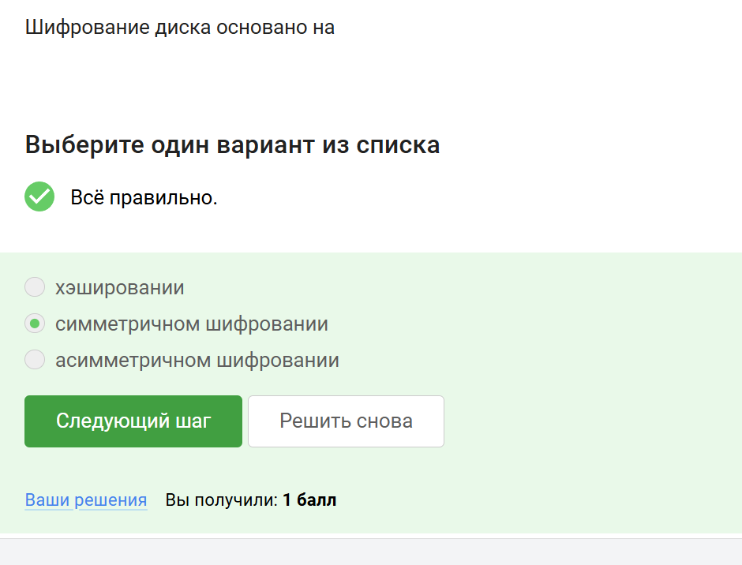
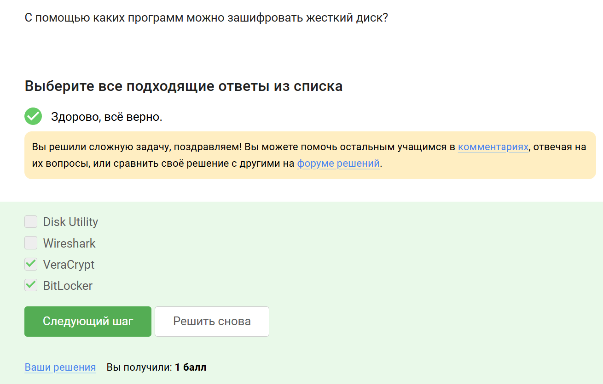
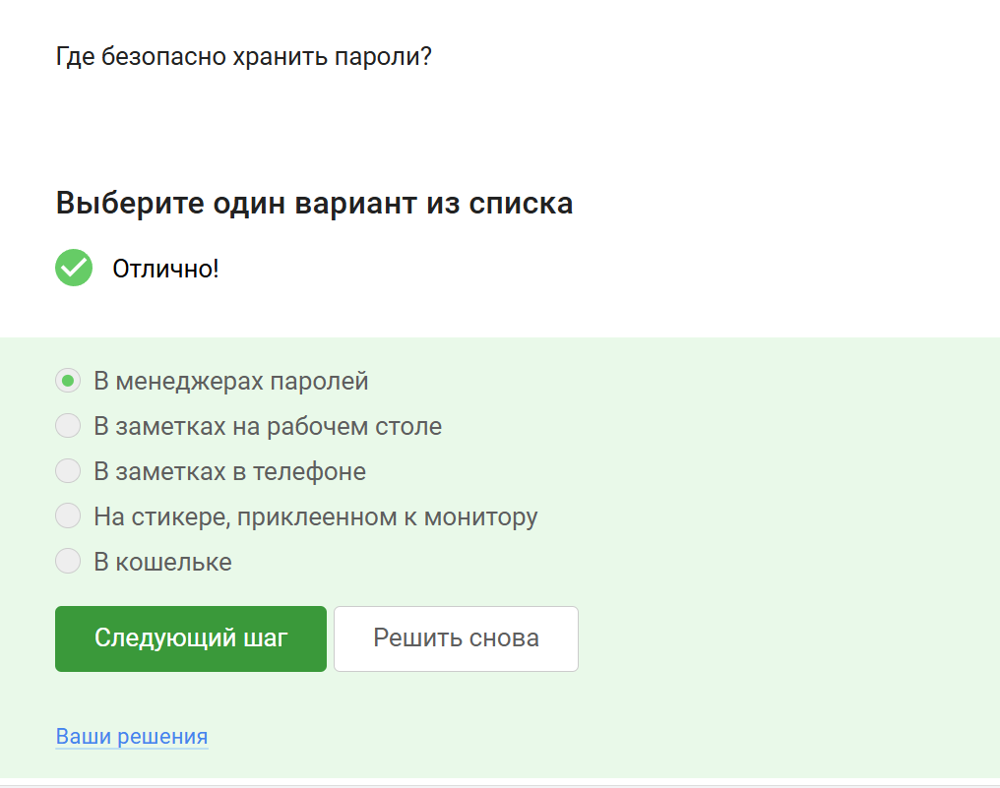
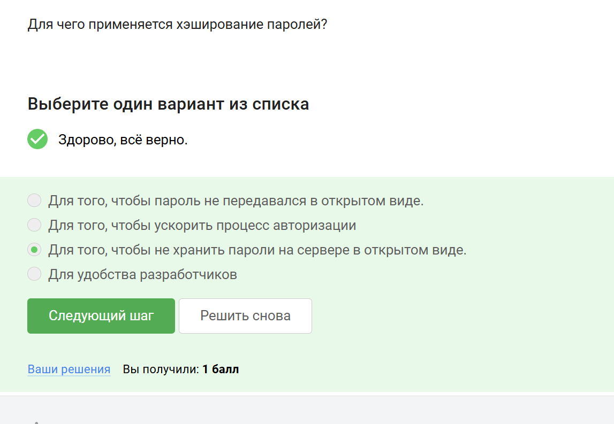
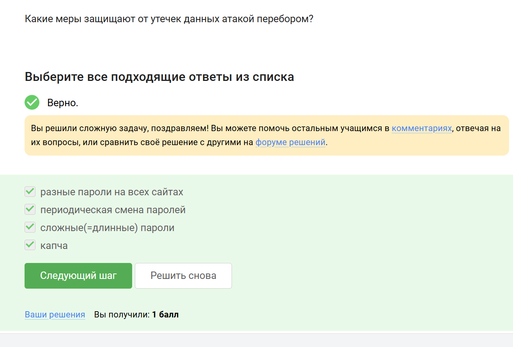
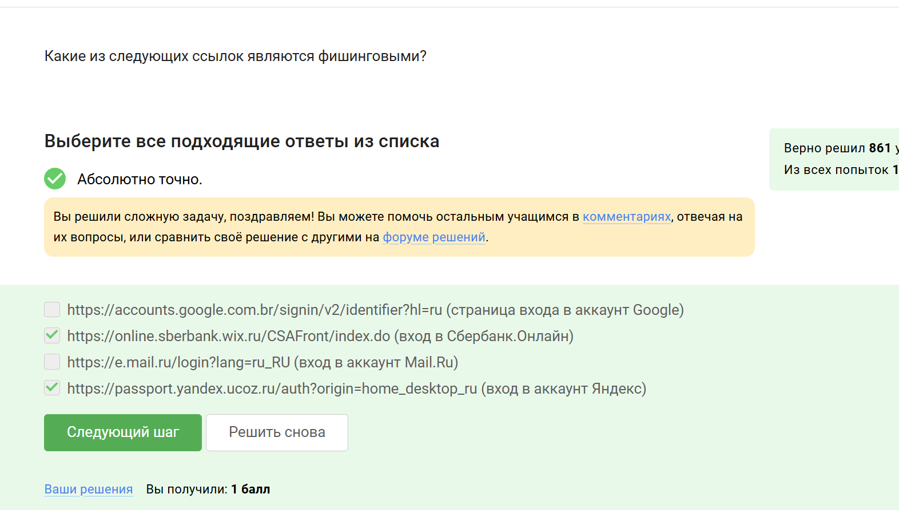

---
## Front matter
lang: ru-RU
title: Прохождение внешнего курса
subtitle: 2 часть
author:
  - Дагделен З. Р.
institute:
  - Российский университет дружбы народов, Москва, Россия
date: 10 мая 2025

## i18n babel
babel-lang: russian
babel-otherlangs: english

## Formatting pdf
toc: false
toc-title: Содержание
slide_level: 2
aspectratio: 169
section-titles: true
theme: metropolis
header-includes:
 - \metroset{progressbar=frametitle,sectionpage=progressbar,numbering=fraction}
---

## Докладчик

:::::::::::::: {.columns align=center}
::: {.column width="70%"}

  * Дагделен Зейнап Реджеповна
  * студентка из группы НКАбд-02-23
  * Факультет физико-математических и естественных наук
  * Российский университет дружбы народов
  * [1132236052@rudn.ru](mailto:1132236052@rudn.ru)

:::
::: {.column width="50%"}

:::
::::::::::::::

## Выполнение заданий

Так как заданий много, покажу лишь часть.

## Можно ли зашифровать загрузочный сектор диска
**Комментарий:** Да, загрузочный сектор диска можно зашифровать, например, с помощью инструментов вроде VeraCrypt или BitLocker (рис. [-@fig:001]).    

{#fig:001 width=70%}  

## Шифрование диска основано на
**Комментарий:** Шифрование диска использует симметричное шифрование для обеспечения безопасности данных (рис. [-@fig:002]).  
  
{#fig:002 width=70%}

## С помощью каких программ можно зашифровать жесткий диск?
**Комментарий:** VeraCrypt и BitLocker — популярные программы для шифрования жесткого диска (рис. [-@fig:003]).  

{#fig:003 width=70%}  

## Какие пароли можно отнести к стойким?
**Комментарий:** Стойкий пароль содержит сложную комбинацию символов, например, `UQr9@j4!S$` (рис. [-@fig:004]).  

{#fig:004 width=70%}  

## Где безопасно хранить пароли?
**Комментарий:** Менеджеры паролей — наиболее безопасный способ хранения паролей (рис. [-@fig:005]).  

{#fig:005 width=70%}  

## Зачем нужна капча?
**Комментарий:** Капча защищает от автоматизированных атак, таких как брутфорс (рис. [-@fig:006]).  

{#fig:006 width=70%}  

## Для чего применяется хэширование паролей?
**Комментарий:** Хэширование паролей предотвращает хранение паролей в открытом виде на сервере (рис. [-@fig:007]).  

{#fig:007 width=70%}  

## Какие меры защищают от утечек данных атакой перебором?
**Комментарий:** Сложные пароли, капча и их периодическая смена снижают риск утечек (рис. [-@fig:008]).  

{#fig:008 width=70%}  

##  Какие из следующих ссылок являются фишинговыми?
**Комментарий:** Фишинговые ссылки имитируют легитимные сайты, например, поддельный адрес Сбербанка (рис. [-@fig:009]).  

{#fig:009 width=70%}  
