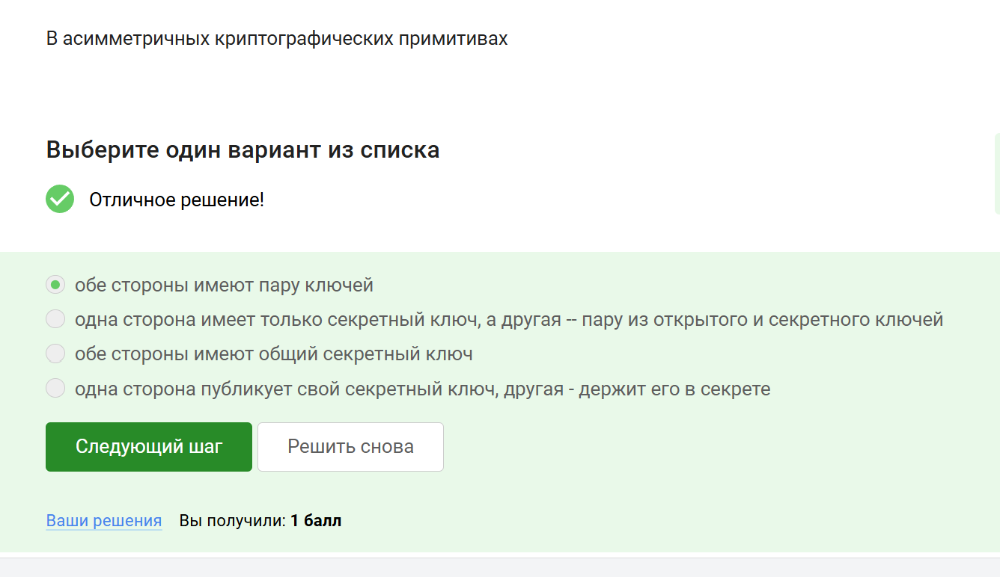
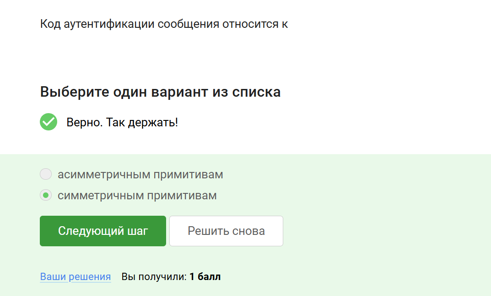
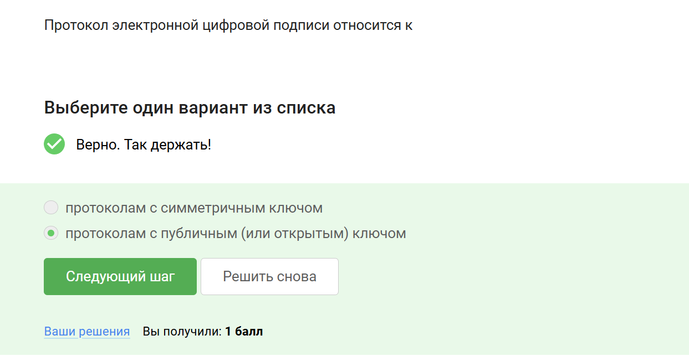

---
## Front matter
lang: ru-RU
title: Прохождение внешнего курса
subtitle: 3 часть
author:
  - Дагделен З. Р.
institute:
  - Российский университет дружбы народов, Москва, Россия
date: 10 мая 2025

## i18n babel
babel-lang: russian
babel-otherlangs: english

## Formatting pdf
toc: false
toc-title: Содержание
slide_level: 2
aspectratio: 169
section-titles: true
theme: metropolis
header-includes:
 - \metroset{progressbar=frametitle,sectionpage=progressbar,numbering=fraction}
---

## Докладчик

:::::::::::::: {.columns align=center}
::: {.column width="70%"}

  * Дагделен Зейнап Реджеповна
  * студентка из группы НКАбд-02-23
  * Факультет физико-математических и естественных наук
  * Российский университет дружбы народов
  * [1132236052@rudn.ru](mailto:1132236052@rudn.ru)

:::
::: {.column width="50%"}

:::
::::::::::::::

## Выполнение заданий

Так как заданий много, покажу лишь часть.

## В асимметричных криптографических примитивах
**Комментарий:** В асимметричной криптографии обе стороны имеют пару ключей: открытый и секретный (рис. [-@fig:001]).  

{#fig:001 width=70%}

##  Свойства криптографической хэш-функции
**Комментарий:** Хэш-функция должна быть стойкой к коллизиям, эффективно вычисляемой и иметь фиксированный размер вывода (рис. [-@fig:002]).  

{#fig:002 width=70%}

##  Алгоритмы цифровой подписи
**Комментарий:** RSA, ECDSA и ГОСТ Р 34.10-2012 — стандартные алгоритмы цифровой подписи (рис. [-@fig:003]).  

{#fig:003 width=70%}

##  Код аутентификации сообщения
**Комментарий:** Код аутентификации сообщения (MAC) относится к симметричным криптографическим примитивам (рис. [-@fig:004]). 
 
{#fig:004 width=70%}  

## Обмен ключами Диффи-Хеллмана
**Комментарий:** Диффи-Хеллман — это асимметричный примитив для генерации общего секретного ключа (рис. [-@fig:005]). 
 
{#fig:005 width=70%}  

## Протокол электронной цифровой подписи
**Комментарий:** ЭЦП использует протоколы с открытым ключом для обеспечения аутентичности и целостности (рис. [-@fig:006]).  

{#fig:006 width=70%}  

## Верификация электронной подписи
**Комментарий:** Для верификации подписи нужны сама подпись, открытый ключ и исходное сообщение (рис. [-@fig:007]). 
 
{#fig:007 width=70%} 

## Итог

Прошла весь курс. Вот доказательство (рис. [-@fig:008]).  

{#fig:008 width=70%}  
