---
## Front matter
title: "Отчет по внешнему курсу"
subtitle: "2. Безопасность в сети"
author: "Дагделен Зейнап Реджеповна"

## Generic otions
lang: ru-RU
toc-title: "Содержание"

## Bibliography
bibliography: bib/cite.bib
csl: pandoc/csl/gost-r-7-0-5-2008-numeric.csl

## Pdf output format
toc: true # Table of contents
toc-depth: 2
lof: true # List of figures
lot: true # List of tables
fontsize: 12pt
linestretch: 1.5
papersize: a4
documentclass: scrreprt
## I18n polyglossia
polyglossia-lang:
  name: russian
  options:
	- spelling=modern
	- babelshorthands=true
polyglossia-otherlangs:
  name: english
## I18n babel
babel-lang: russian
babel-otherlangs: english
## Fonts
mainfont: IBM Plex Serif
romanfont: IBM Plex Serif
sansfont: IBM Plex Sans
monofont: IBM Plex Mono
mathfont: STIX Two Math
mainfontoptions: Ligatures=Common,Ligatures=TeX,Scale=0.94
romanfontoptions: Ligatures=Common,Ligatures=TeX,Scale=0.94
sansfontoptions: Ligatures=Common,Ligatures=TeX,Scale=MatchLowercase,Scale=0.94
monofontoptions: Scale=MatchLowercase,Scale=0.94,FakeStretch=0.9
mathfontoptions:
## Biblatex
biblatex: true
biblio-style: "gost-numeric"
biblatexoptions:
  - parentracker=true
  - backend=biber
  - hyperref=auto
  - language=auto
  - autolang=other*
  - citestyle=gost-numeric
## Pandoc-crossref LaTeX customization
figureTitle: "Рис."
tableTitle: "Таблица"
listingTitle: "Листинг"
lofTitle: "Список иллюстраций"
lotTitle: "Список таблиц"
lolTitle: "Листинги"
## Misc options
indent: true
header-includes:
  - \usepackage{indentfirst}
  - \usepackage{float} # keep figures where there are in the text
  - \floatplacement{figure}{H} # keep figures where there are in the text
---

# Цель работы

Изучить основы кибербезопасности и пройти внешний курс.

# Выполнение заданий внешнего курса

## Протокол прикладного уровня
**Комментарий:** HTTPS — это протокол прикладного уровня, обеспечивающий безопасную передачу данных (рис. [-@fig:001]).  

{#fig:001 width=70%}

##  Уровень работы протокола TCP
**Комментарий:** TCP работает на транспортном уровне модели OSI (рис. [-@fig:002]).  

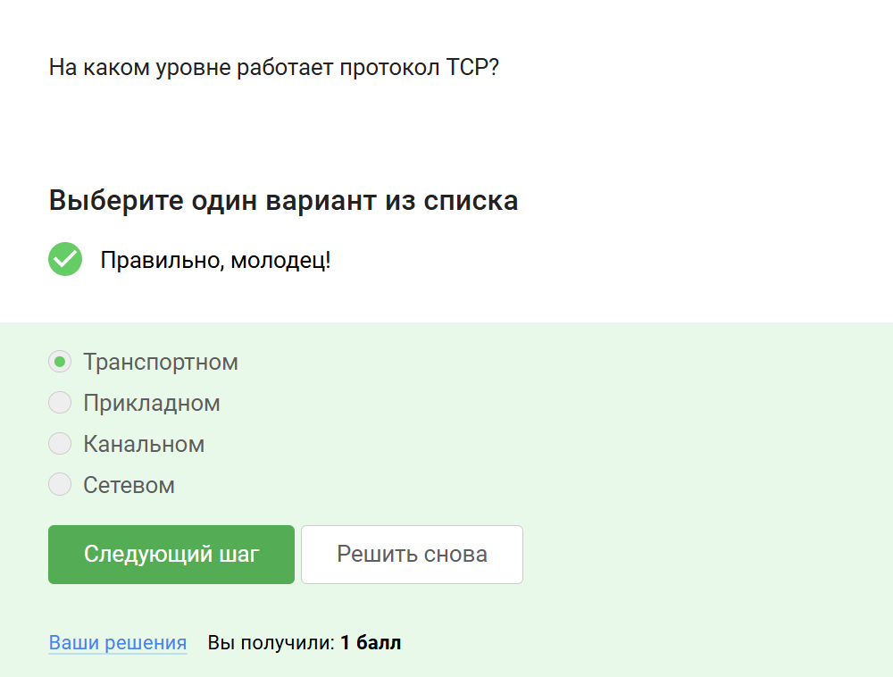{#fig:002 width=70%}

##  Корректные адреса IPv4
**Комментарий:** Примеры корректных IPv4-адресов: `90.11.90.22` и `25.198.0.15`(рис. [-@fig:003]).  

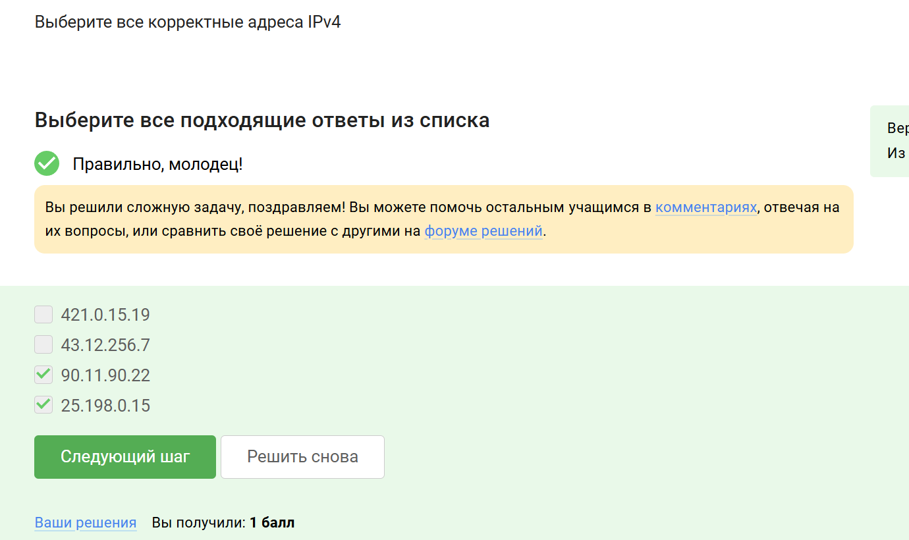{#fig:003 width=70%}

##  Функция DNS сервера
**Комментарий:** DNS сервер сопоставляет доменные имена с IP-адресами(рис. [-@fig:004]). 
 
{#fig:004 width=70%}  

## Последовательность протоколов в TCP/IP
**Комментарий:** Правильный порядок: прикладной → транспортный → сетевой → канальный (рис. [-@fig:005]). 
 
{#fig:005 width=70%}  

## Протокол HTTP
**Комментарий:** HTTP передает данные между клиентом и сервером в открытом виде (рис. [-@fig:006]).  

{#fig:006 width=70%}  

##  Состав протокола HTTPS

**Комментарий:** HTTPS включает фазы рукопожатия и передачи данных с шифрованием (рис. [-@fig:007]). 
 
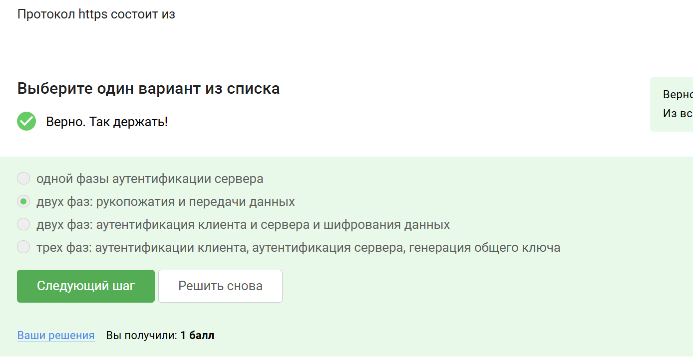{#fig:007 width=70%}  

## Определение версии TLS

**Комментарий:** Версия TLS согласуется между клиентом и сервером в процессе "переговоров"(рис. [-@fig:008]). 
 
{#fig:008 width=70%}  

##  Фаза "рукопожатия" в TLS
**Комментарий:** В этой фазе не происходит шифрование данных, только согласование параметров (рис. [-@fig:009]).  

{#fig:009 width=70%}  

## Данные для аутентификации
**Комментарий:** Для аутентификации могут использоваться идентификатор пользователя и пароль (рис. [-@fig:010]). 
 
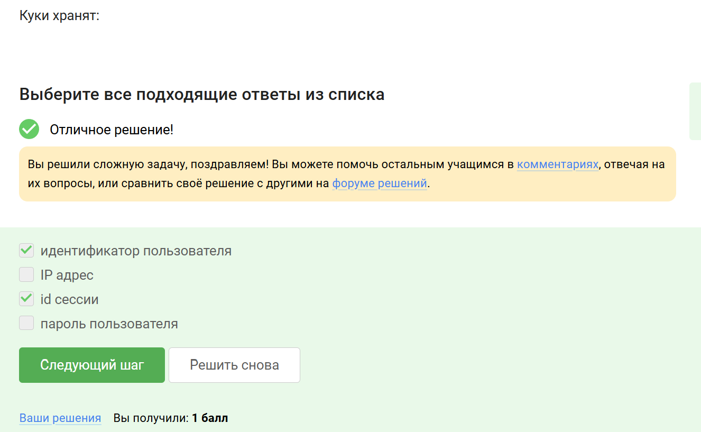{#fig:010 width=70%}  

##  Использование куки
**Комментарий:** Куки не предназначены для улучшения надежности соединения (рис. [-@fig:011]).  

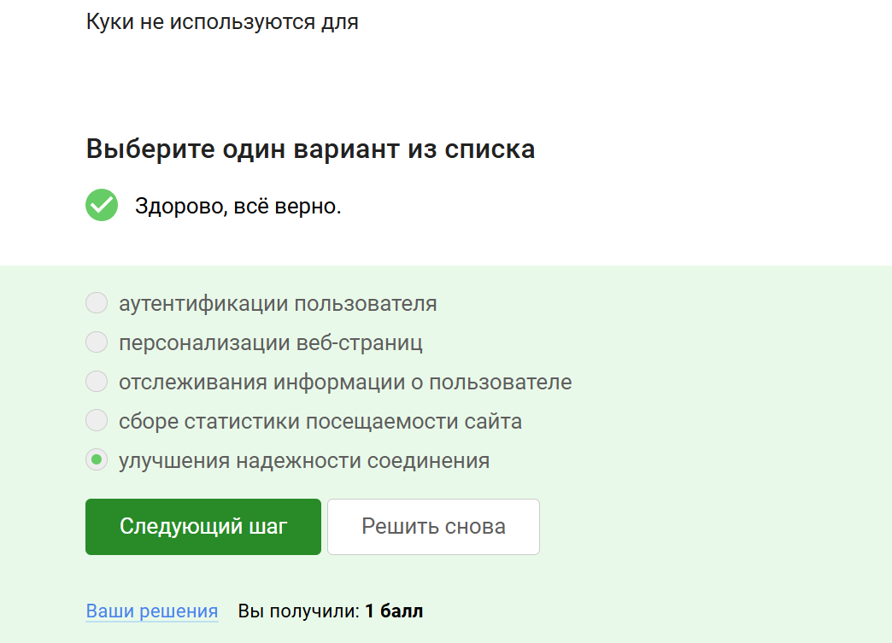{#fig:011 width=70%}  

##  Генерация куки
**Комментарий:** Куки создаются сервером и отправляются клиенту(рис. [-@fig:012]).  

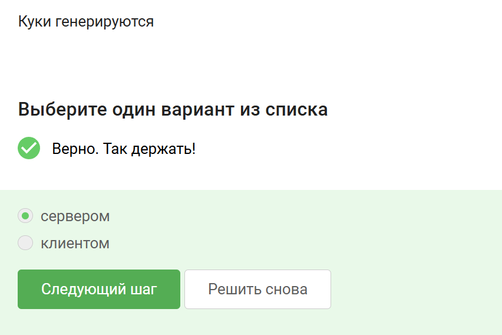{#fig:012 width=70%}  

## Хранение сессионных куки
**Комментарий:** Сессионные куки хранятся в браузере только во время использования сайта (рис. [-@fig:013]).  

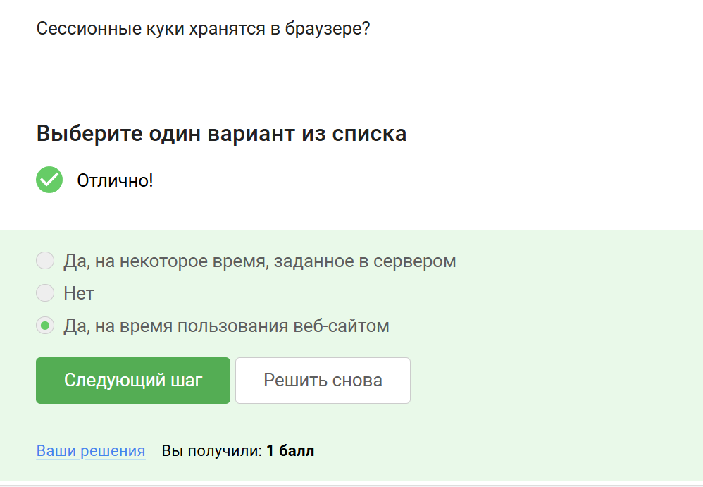{#fig:013 width=70%}  

##  Промежуточные узлы в TOR
**Комментарий:** В сети TOR используется 3 промежуточных узла(рис. [-@fig:014]).  

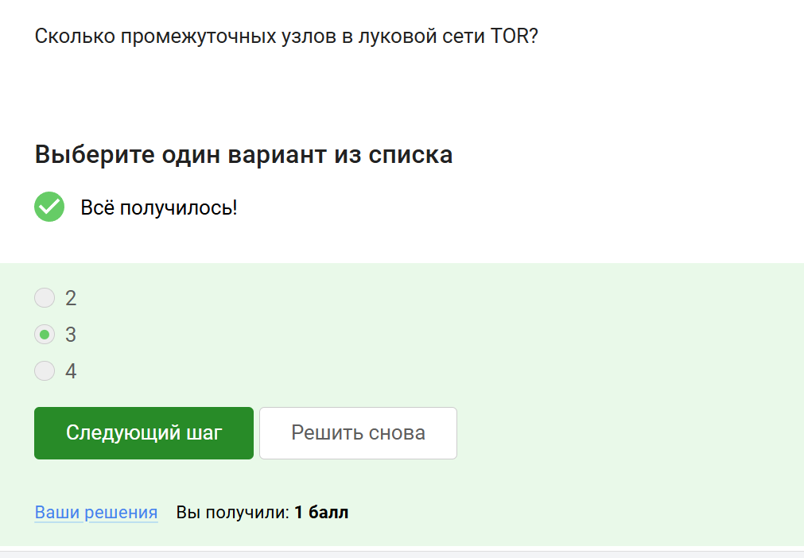{#fig:014 width=70%}  

##  Узлы в луковой сети TOR
**Комментарий:** Ключевые узлы: охранный, промежуточный и выходной (рис. [-@fig:015]).  

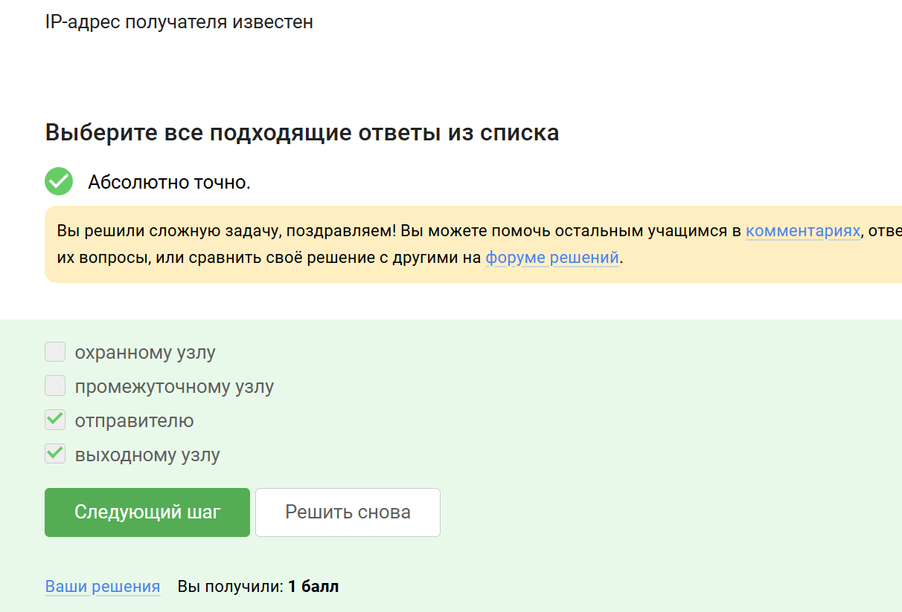{#fig:015 width=70%}  

##  Генерация ключа в TOR
**Комментарий:** Отправитель создает общий ключ с охранным, промежуточным и выходным узлами (рис. [-@fig:016]).  

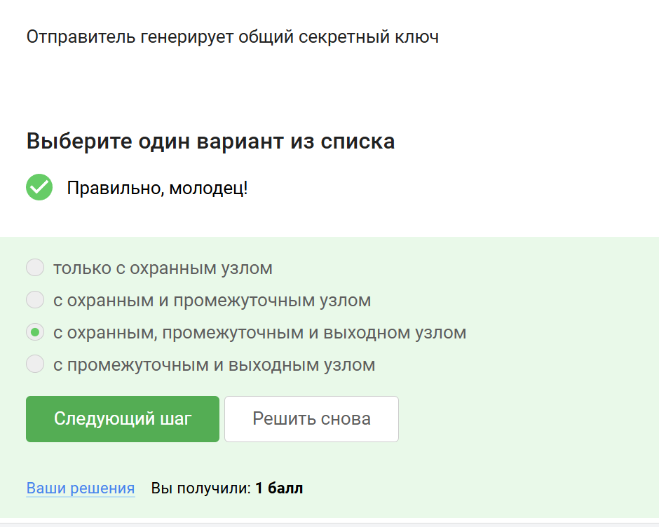{#fig:016 width=70%}  

## Использование браузера TOR получателем
**Комментарий:** Получателю не требуется использовать TOR для получения пакетов (рис. [-@fig:017]).  

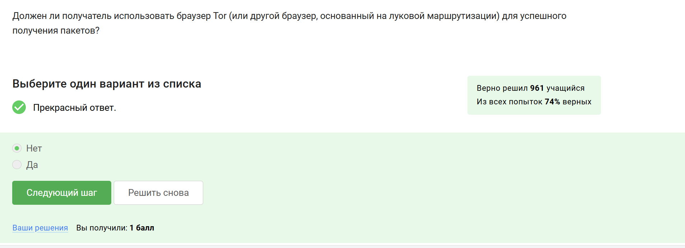{#fig:017 width=70%}  

## Определение Wi-Fi
**Комментарий:** Wi-Fi — это технология беспроводной сети по стандарту IEEE 802.11. (рис. [-@fig:018]) 

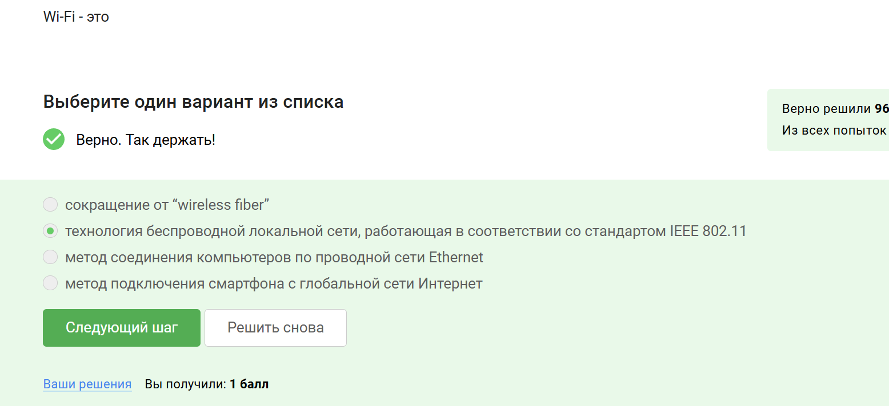{#fig:018 width=70%}  

## Уровень работы протокола Wi-Fi
**Комментарий:** Wi-Fi работает на канальном уровне модели OSI (рис. [-@fig:019]).  

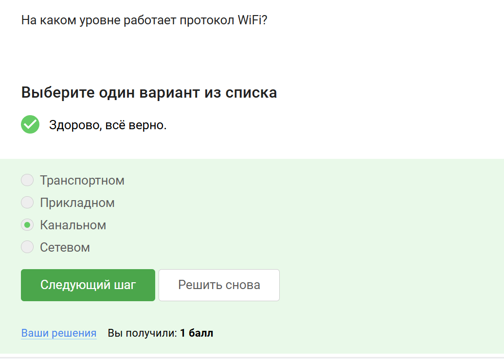{#fig:019 width=70%} 

## Небезопасный метод шифрования Wi-Fi
**Комментарий:** WEP устарел и считается небезопасным (рис. [-@fig:020]).  

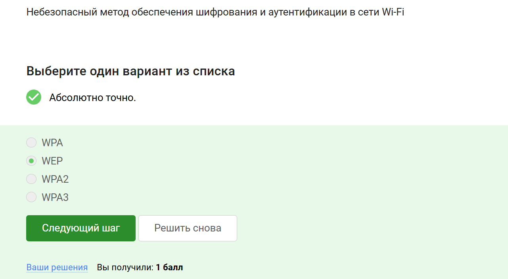{#fig:020 width=70%}  

## Передача данных между хостом и роутером
**Комментарий:** Данные между хостом и роутером передаются в зашифрованном виде после аутентификации устройств (рис. [-@fig:021]). 
 
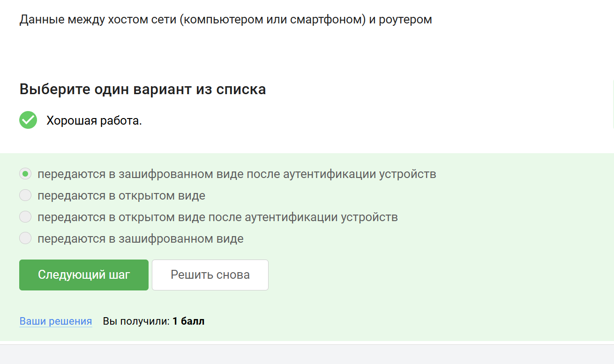{#fig:021 width=70%}  

## Метод аутентификации в домашней сети
**Комментарий:** В домашних сетях обычно используется WPA2 Personal для аутентификации устройств (рис. [-@fig:022]).
  
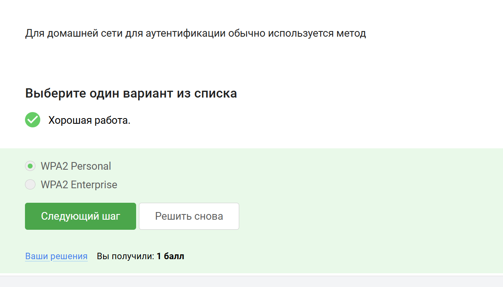{#fig:022 width=70%}  

# Выводы

Я прошла 1 часть курса

