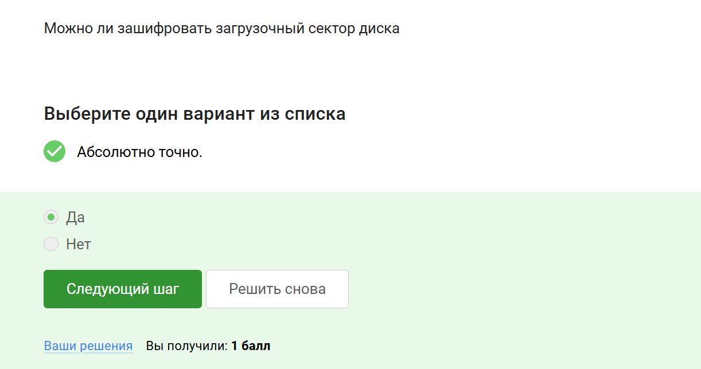
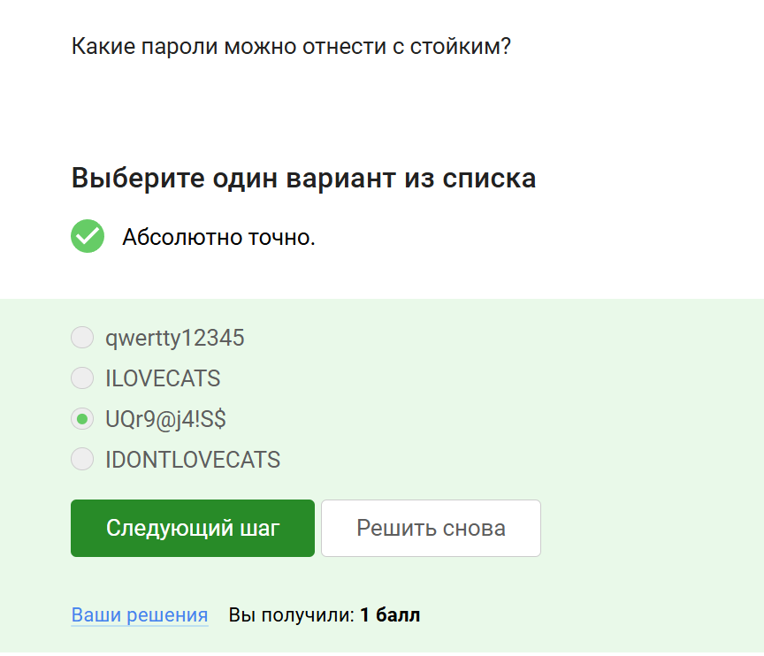
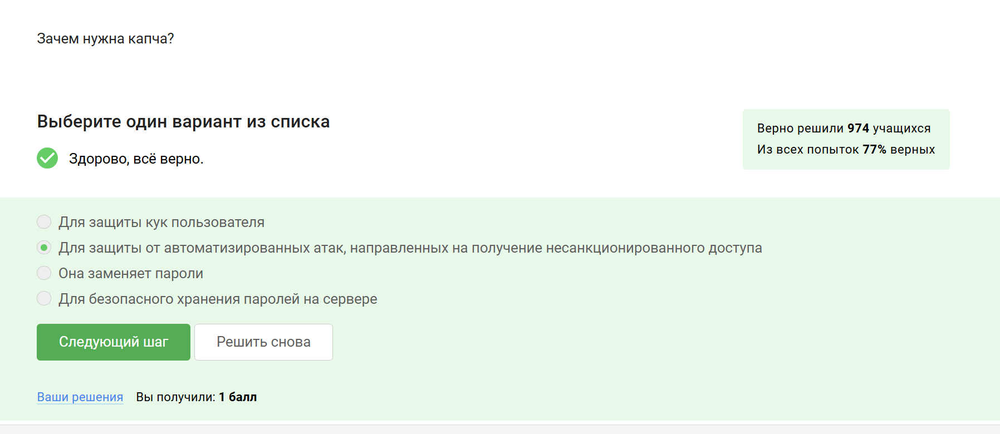
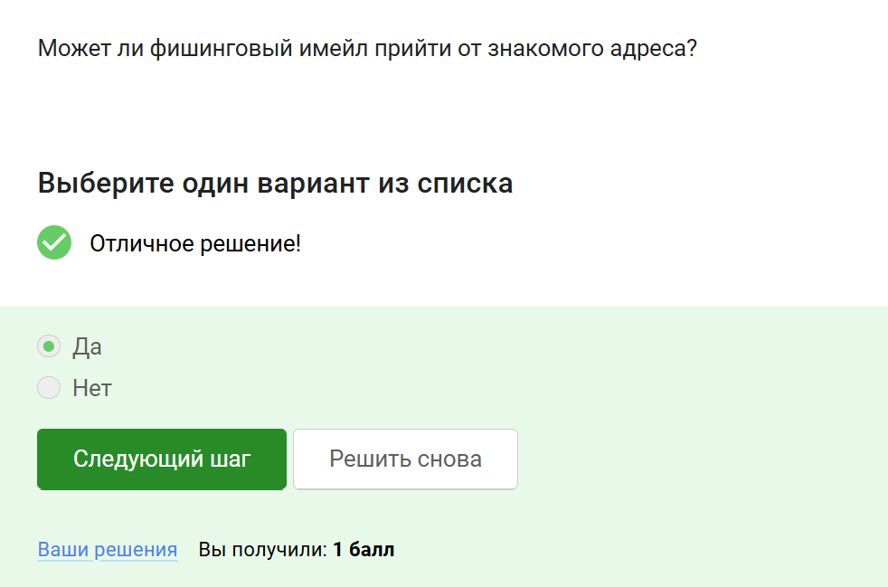
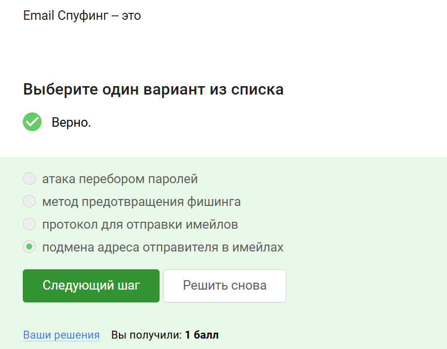
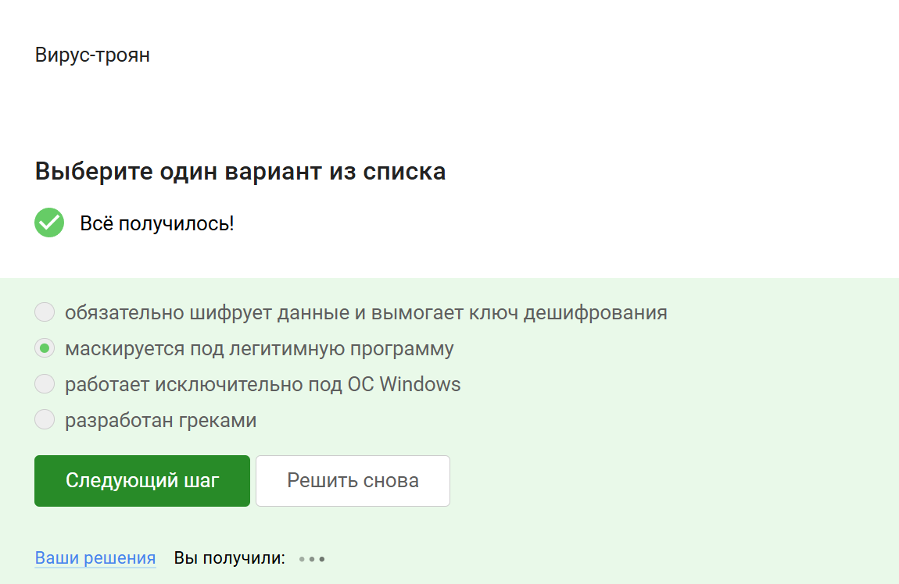
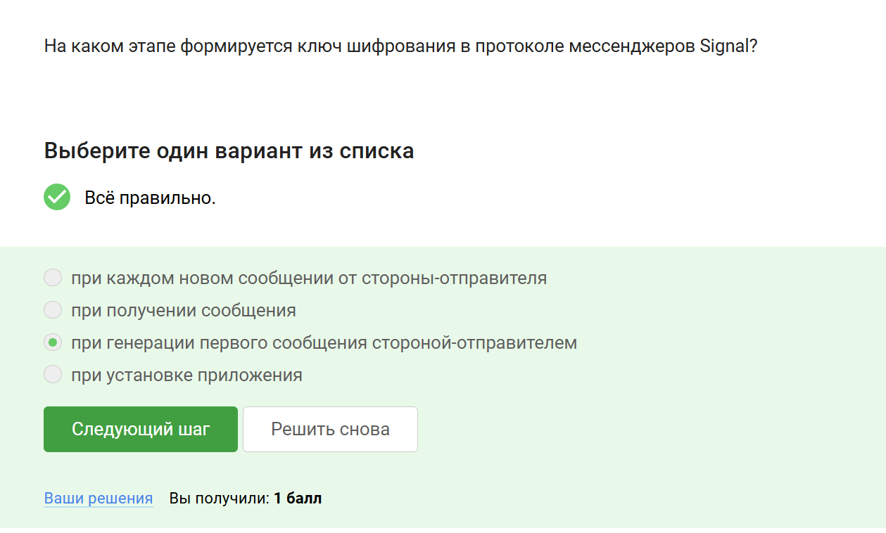
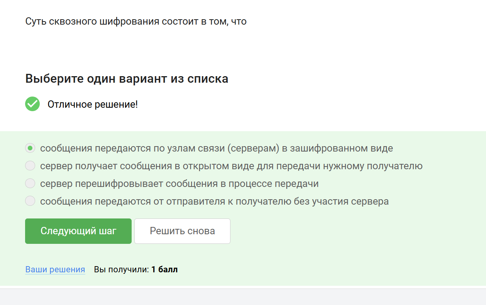

---
## Front matter
title: "Отчет по внешнему курсу"
subtitle: "3. Защита ПК/телефона"
author: "Дагделен Зейнап Реджеповна"

## Generic otions
lang: ru-RU
toc-title: "Содержание"

## Bibliography
bibliography: bib/cite.bib
csl: pandoc/csl/gost-r-7-0-5-2008-numeric.csl

## Pdf output format
toc: true # Table of contents
toc-depth: 2
lof: true # List of figures
lot: true # List of tables
fontsize: 12pt
linestretch: 1.5
papersize: a4
documentclass: scrreprt
## I18n polyglossia
polyglossia-lang:
  name: russian
  options:
	- spelling=modern
	- babelshorthands=true
polyglossia-otherlangs:
  name: english
## I18n babel
babel-lang: russian
babel-otherlangs: english
## Fonts
mainfont: IBM Plex Serif
romanfont: IBM Plex Serif
sansfont: IBM Plex Sans
monofont: IBM Plex Mono
mathfont: STIX Two Math
mainfontoptions: Ligatures=Common,Ligatures=TeX,Scale=0.94
romanfontoptions: Ligatures=Common,Ligatures=TeX,Scale=0.94
sansfontoptions: Ligatures=Common,Ligatures=TeX,Scale=MatchLowercase,Scale=0.94
monofontoptions: Scale=MatchLowercase,Scale=0.94,FakeStretch=0.9
mathfontoptions:
## Biblatex
biblatex: true
biblio-style: "gost-numeric"
biblatexoptions:
  - parentracker=true
  - backend=biber
  - hyperref=auto
  - language=auto
  - autolang=other*
  - citestyle=gost-numeric
## Pandoc-crossref LaTeX customization
figureTitle: "Рис."
tableTitle: "Таблица"
listingTitle: "Листинг"
lofTitle: "Список иллюстраций"
lotTitle: "Список таблиц"
lolTitle: "Листинги"
## Misc options
indent: true
header-includes:
  - \usepackage{indentfirst}
  - \usepackage{float} # keep figures where there are in the text
  - \floatplacement{figure}{H} # keep figures where there are in the text
---

# Цель работы

Изучить основы кибербезопасности и пройти внешний курс.

# Выполнение заданий внешнего курса

## Можно ли зашифровать загрузочный сектор диска
**Комментарий:** Да, загрузочный сектор диска можно зашифровать, например, с помощью инструментов вроде VeraCrypt или BitLocker (рис. [-@fig:001]).    

{#fig:001 width=70%}  

## Шифрование диска основано на
**Комментарий:** Шифрование диска использует симметричное шифрование для обеспечения безопасности данных (рис. [-@fig:002]).  
  
{#fig:002 width=70%}

## С помощью каких программ можно зашифровать жесткий диск?
**Комментарий:** VeraCrypt и BitLocker — популярные программы для шифрования жесткого диска (рис. [-@fig:003]).  

{#fig:003 width=70%}  

## Какие пароли можно отнести к стойким?
**Комментарий:** Стойкий пароль содержит сложную комбинацию символов, например, `UQr9@j4!S$` (рис. [-@fig:004]).  

{#fig:004 width=70%}  

## Где безопасно хранить пароли?
**Комментарий:** Менеджеры паролей — наиболее безопасный способ хранения паролей (рис. [-@fig:005]).  

{#fig:005 width=70%}  

## Зачем нужна капча?
**Комментарий:** Капча защищает от автоматизированных атак, таких как брутфорс (рис. [-@fig:006]).  

{#fig:006 width=70%}  

## Для чего применяется хэширование паролей?
**Комментарий:** Хэширование паролей предотвращает хранение паролей в открытом виде на сервере (рис. [-@fig:007]).  

{#fig:007 width=70%}  

## Какие меры защищают от утечек данных атакой перебором?
**Комментарий:** Сложные пароли, капча и их периодическая смена снижают риск утечек (рис. [-@fig:008]).  

{#fig:008 width=70%}  

##  Какие из следующих ссылок являются фишинговыми?
**Комментарий:** Фишинговые ссылки имитируют легитимные сайты, например, поддельный адрес Сбербанка (рис. [-@fig:009]).  

{#fig:009 width=70%}  

## Может ли фишинговый имейл прийти от знакомого адреса?
**Комментарий:** Да, если злоумышленник подменил адрес отправителя (спуфинг) (рис. [-@fig:010]).  

{#fig:010 width=70%}  

## Email Спуфинг – это
**Комментарий:** Спуфинг — это подмена адреса отправителя в письмах для обмана получателя (рис. [-@fig:011]).  

{#fig:011 width=70%}    

## Вирус-троян
**Комментарий:** Троян маскируется под легитимную программу, чтобы обмануть пользователя(рис. [-@fig:012]).   
 
{#fig:012 width=70%}    

## Ключ шифрования в Signal
**Комментарий:** В Signal ключ шифрования формируется при генерации первого сообщения (рис. [-@fig:013]).  

{#fig:013 width=70%}  

## Суть сквозного шифрования
**Комментарий:** Сквозное шифрование исключает доступ сервера к содержимому сообщений(рис. [-@fig:014]).  

{#fig:014 width=70%}    

# Выводы

Я прошла 2 часть курса
