---
## Front matter
title: "Отчет по внешнему курсу"
subtitle: "4. Криптография на практике"
author: "Дагделен Зейнап Реджеповна"

## Generic otions
lang: ru-RU
toc-title: "Содержание"

## Bibliography
bibliography: bib/cite.bib
csl: pandoc/csl/gost-r-7-0-5-2008-numeric.csl

## Pdf output format
toc: true # Table of contents
toc-depth: 2
lof: true # List of figures
lot: true # List of tables
fontsize: 12pt
linestretch: 1.5
papersize: a4
documentclass: scrreprt
## I18n polyglossia
polyglossia-lang:
  name: russian
  options:
	- spelling=modern
	- babelshorthands=true
polyglossia-otherlangs:
  name: english
## I18n babel
babel-lang: russian
babel-otherlangs: english
## Fonts
mainfont: IBM Plex Serif
romanfont: IBM Plex Serif
sansfont: IBM Plex Sans
monofont: IBM Plex Mono
mathfont: STIX Two Math
mainfontoptions: Ligatures=Common,Ligatures=TeX,Scale=0.94
romanfontoptions: Ligatures=Common,Ligatures=TeX,Scale=0.94
sansfontoptions: Ligatures=Common,Ligatures=TeX,Scale=MatchLowercase,Scale=0.94
monofontoptions: Scale=MatchLowercase,Scale=0.94,FakeStretch=0.9
mathfontoptions:
## Biblatex
biblatex: true
biblio-style: "gost-numeric"
biblatexoptions:
  - parentracker=true
  - backend=biber
  - hyperref=auto
  - language=auto
  - autolang=other*
  - citestyle=gost-numeric
## Pandoc-crossref LaTeX customization
figureTitle: "Рис."
tableTitle: "Таблица"
listingTitle: "Листинг"
lofTitle: "Список иллюстраций"
lotTitle: "Список таблиц"
lolTitle: "Листинги"
## Misc options
indent: true
header-includes:
  - \usepackage{indentfirst}
  - \usepackage{float} # keep figures where there are in the text
  - \floatplacement{figure}{H} # keep figures where there are in the text
---

# Цель работы

Изучить основы кибербезопасности и пройти внешний курс.

# Выполнение заданий внешнего курса

## В асимметричных криптографических примитивах
**Комментарий:** В асимметричной криптографии обе стороны имеют пару ключей: открытый и секретный (рис. [-@fig:001]).  

{#fig:001 width=70%}

##  Свойства криптографической хэш-функции
**Комментарий:** Хэш-функция должна быть стойкой к коллизиям, эффективно вычисляемой и иметь фиксированный размер вывода (рис. [-@fig:002]).  

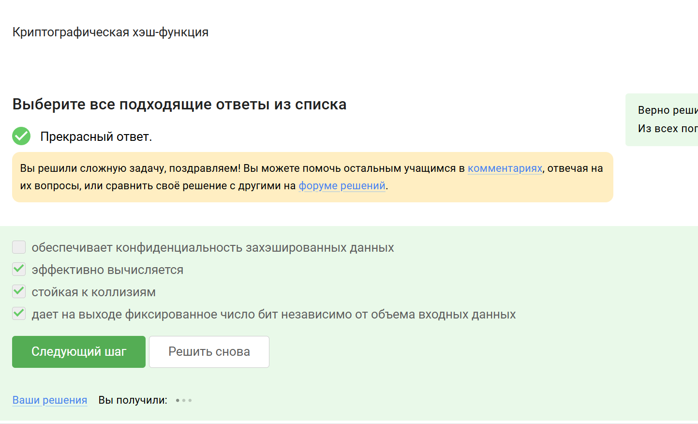{#fig:002 width=70%}

##  Алгоритмы цифровой подписи
**Комментарий:** RSA, ECDSA и ГОСТ Р 34.10-2012 — стандартные алгоритмы цифровой подписи (рис. [-@fig:003]).  

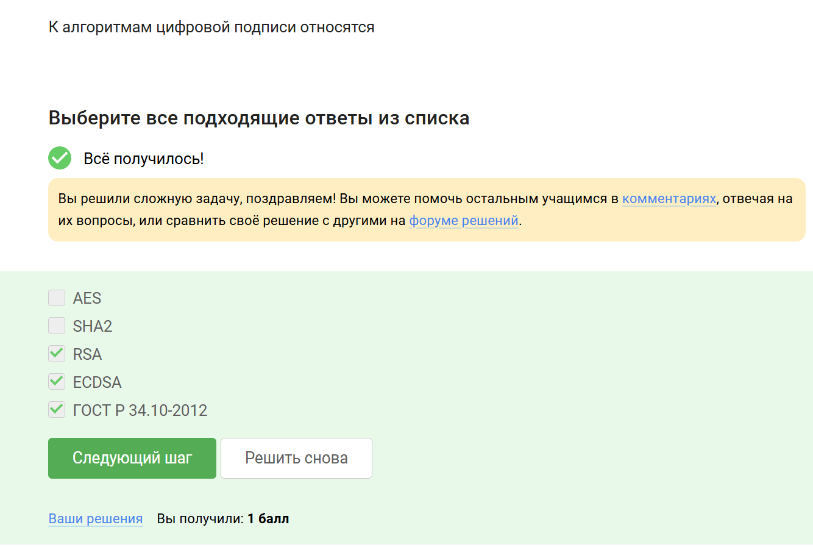{#fig:003 width=70%}

##  Код аутентификации сообщения
**Комментарий:** Код аутентификации сообщения (MAC) относится к симметричным криптографическим примитивам (рис. [-@fig:004]). 
 
{#fig:004 width=70%}  

## Обмен ключами Диффи-Хеллмана
**Комментарий:** Диффи-Хеллман — это асимметричный примитив для генерации общего секретного ключа (рис. [-@fig:005]). 
 
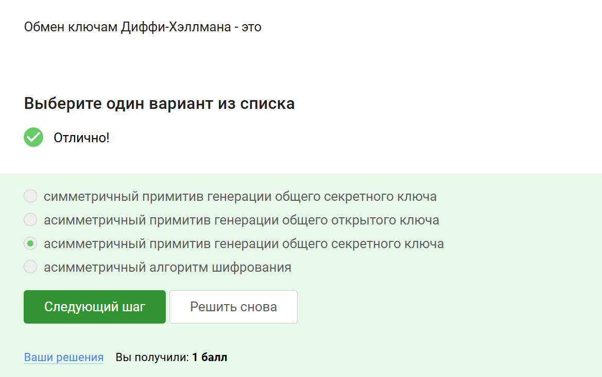{#fig:005 width=70%}  

## Протокол электронной цифровой подписи
**Комментарий:** ЭЦП использует протоколы с открытым ключом для обеспечения аутентичности и целостности (рис. [-@fig:006]).  

{#fig:006 width=70%}  

## Верификация электронной подписи
**Комментарий:** Для верификации подписи нужны сама подпись, открытый ключ и исходное сообщение (рис. [-@fig:007]). 
 
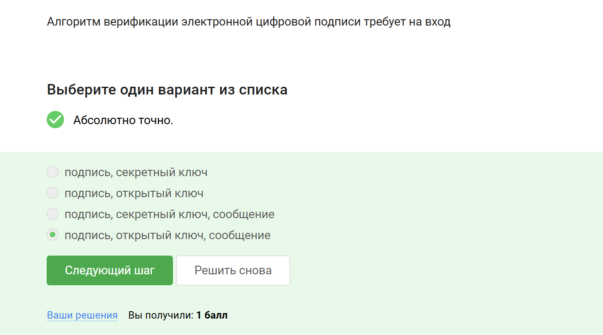{#fig:007 width=70%}  

##  Что не обеспечивает ЭЦП?
**Комментарий:** Электронная подпись не гарантирует конфиденциальность данных (рис. [-@fig:008]). 
 
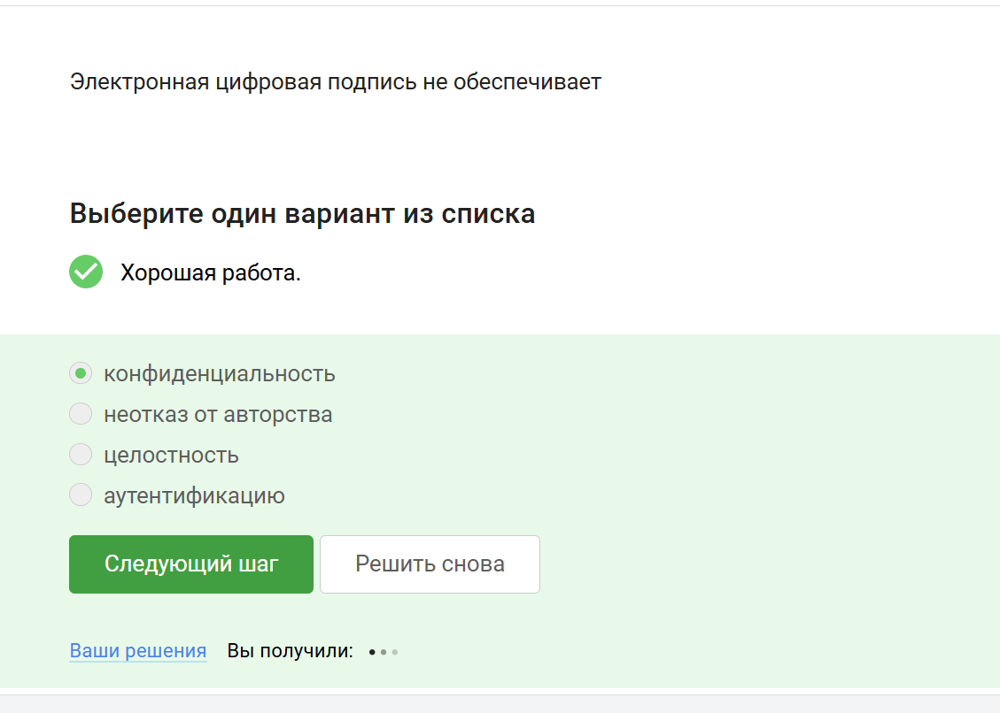{#fig:008 width=70%}  

##  Сертификат для налоговой отчетности
**Комментарий:** Для ФНС требуется усиленная квалифицированная электронная подпись (рис. [-@fig:009]).  

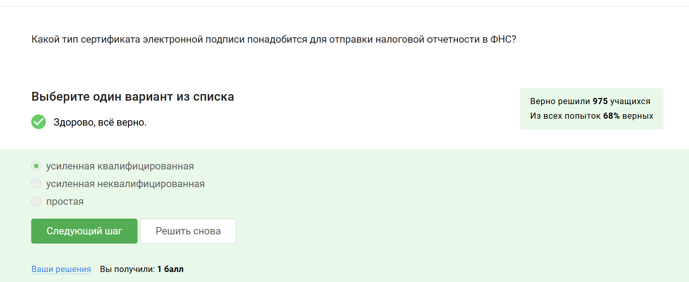{#fig:009 width=70%}  

## Получение квалифицированного сертификата
**Комментарий:** Квалифицированные сертификаты выдаются удостоверяющими центрами (рис. [-@fig:010]). 
 
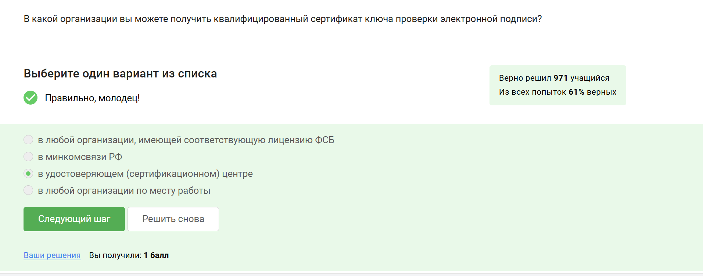{#fig:010 width=70%}  

##  Платежные системы
**Комментарий:** MasterCard и MИP являются примерами платежных систем (рис. [-@fig:011]).  

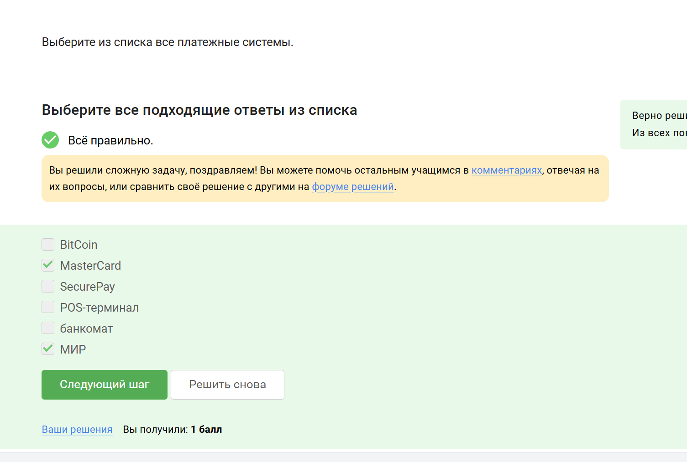{#fig:011 width=70%}  

## Многофакторная аутентификация
**Комментарий:** Примеры: пароль + SMS-код или отпечаток пальца + SMS (рис. [-@fig:012]).  

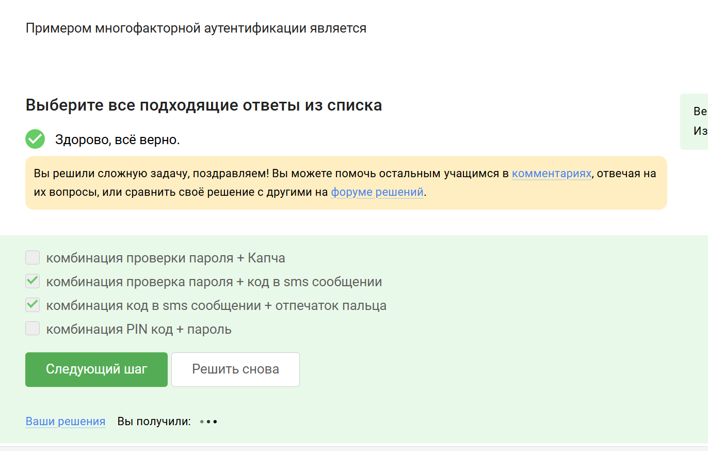{#fig:012 width=70%}  

## Аутентификация при онлайн-платежах
**Комментарий:** Банки используют многофакторную аутентификацию для подтверждения операций (рис. [-@fig:013]).  

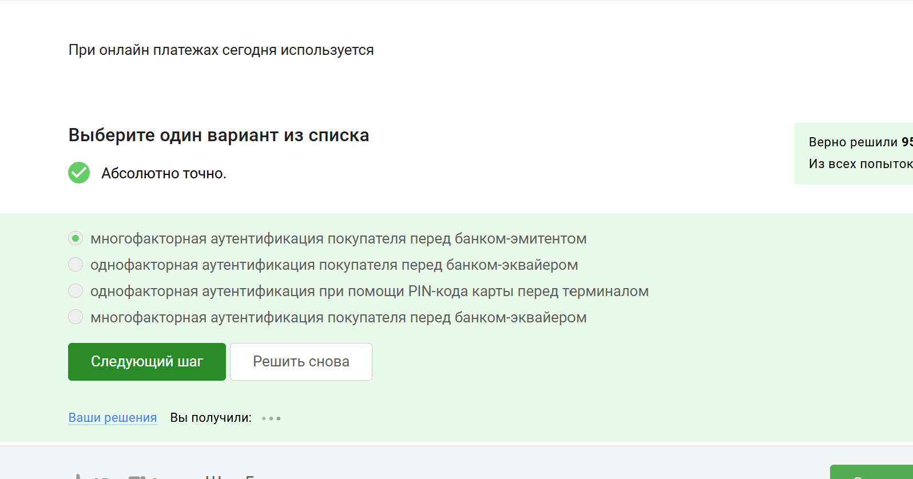{#fig:013 width=70%}  

##  Свойство хэш-функции в Proof-of-Work
**Комментарий:** В PoW критична сложность нахождения прообраза хэш-функции (рис. [-@fig:014]).  

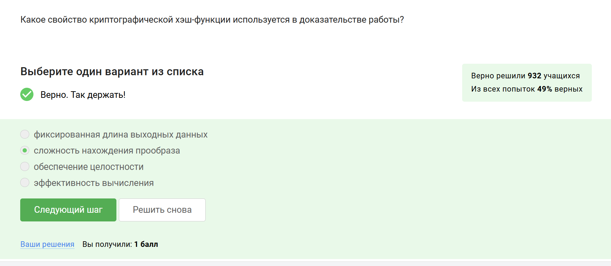{#fig:014 width=70%}  

##  Свойства консенсуса в блокчейне
**Комментарий:** Консенсус обеспечивает живучесть, открытость и неизменность данных (рис. [-@fig:015]).  

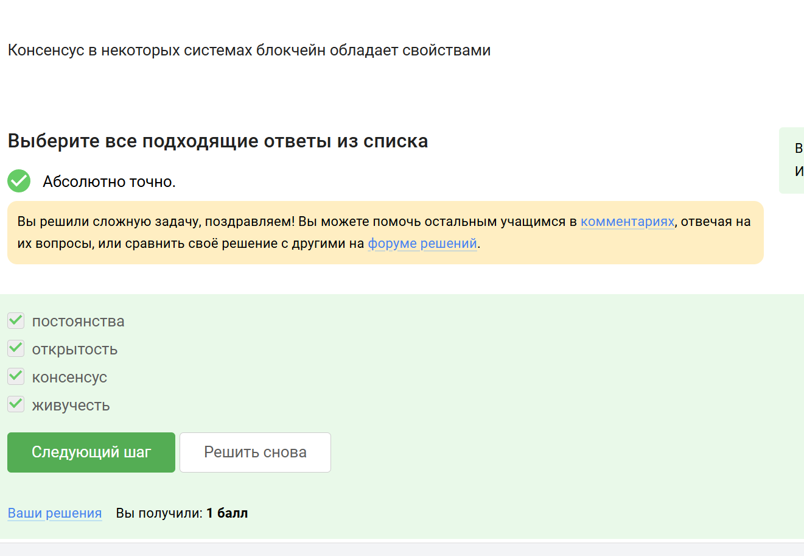{#fig:015 width=70%}  

##  Ключи участников блокчейна
**Комментарий:** Участники хранят секретные ключи для цифровой подписи транзакций (рис. [-@fig:016]). 

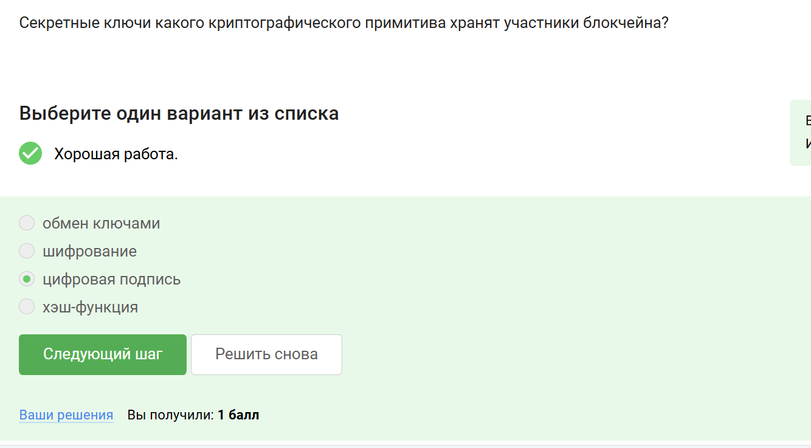{#fig:016 width=70%}  

# Итог 

Прошла весь курс. Вот доказательство (рис. [-@fig:017]).  

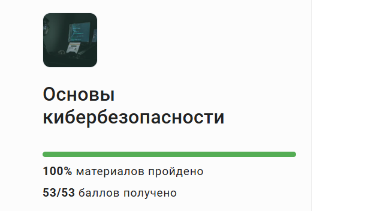{#fig:017 width=70%}  

# Выводы

Я прошла 3 часть курса. В итоге прошла весь курс.

