---
## Front matter
lang: ru-RU
title: Лабораторная работа № 1.
subtitle: Установка и конфигурация операционной системы на виртуальную машину
author:
  - Дагделен З. Р.
institute:
  - Российский университет дружбы народов, Москва, Россия
  
date: 16 февраля 2025

## i18n babel
babel-lang: russian
babel-otherlangs: english

## Formatting pdf
toc: false
toc-title: Содержание
slide_level: 2
aspectratio: 169
section-titles: true
theme: metropolis
header-includes:
 - \metroset{progressbar=frametitle,sectionpage=progressbar,numbering=fraction}
 - '\makeatletter'
 - '\beamer@ignorenonframefalse'
 - '\makeatother'
---

## Докладчик

:::::::::::::: {.columns align=center}
::: {.column width="70%"}

  * Дагделен Зейнап Реджеповна
  * студентка из группы НКАбд-02-23
  * Факультет физико-математических и естественных наук
  * Российский университет дружбы народов
  * [1132236052@rudn.ru](mailto:1132236052@rudn.ru)

:::
::: {.column width="50%"}

:::
::::::::::::::

## Цель работы

Целью данной работы является приобретение практических навыков
установки операционной системы на виртуальную машину, настройки ми-
нимально необходимых для дальнейшей работы сервисов.

## Задание

1. Установка и настройка операционной системы.
2. Найти следующую информацию:
	1. Версия ядра Linux (Linux version).
	2. Частота процессора (Detected Mhz processor).
	3. Модель процессора (CPU0).
	4. Объем доступной оперативной памяти (Memory available).
	5. Тип обнаруженного гипервизора (Hypervisor detected).
	6. Тип файловой системы корневого раздела.

## Выполнение лабораторной работы

Я выполняю лабораторную работу на домашнем оборудовании, поэтому создаю новую виртуальную машину в VirtualBox, выбираю имя, местоположение  и образ ISO, устанавливать будем операционную систему Rocku DVD (рис. 1).

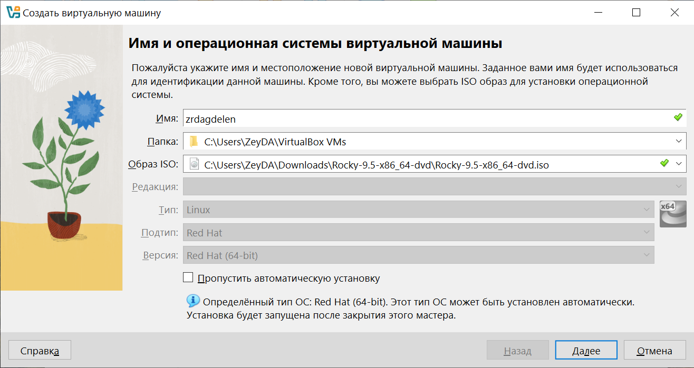{#fig:001 width=70%}

## Выполнение лабораторной работы

Выставляю основной памяти размер 2048 Мб, выбираю 2 процессора (рис. 2).

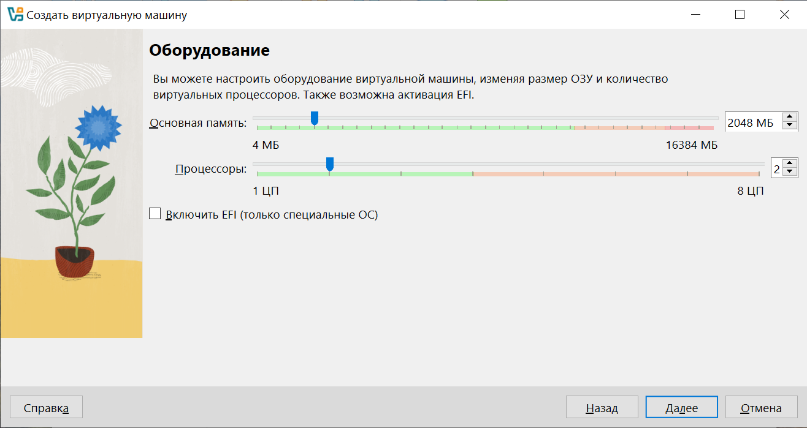{#fig:002 width=70%}

## Выполнение лабораторной работы

Выделаю 40 Гб памяти на виртуальном жестком диске (рис. 3).

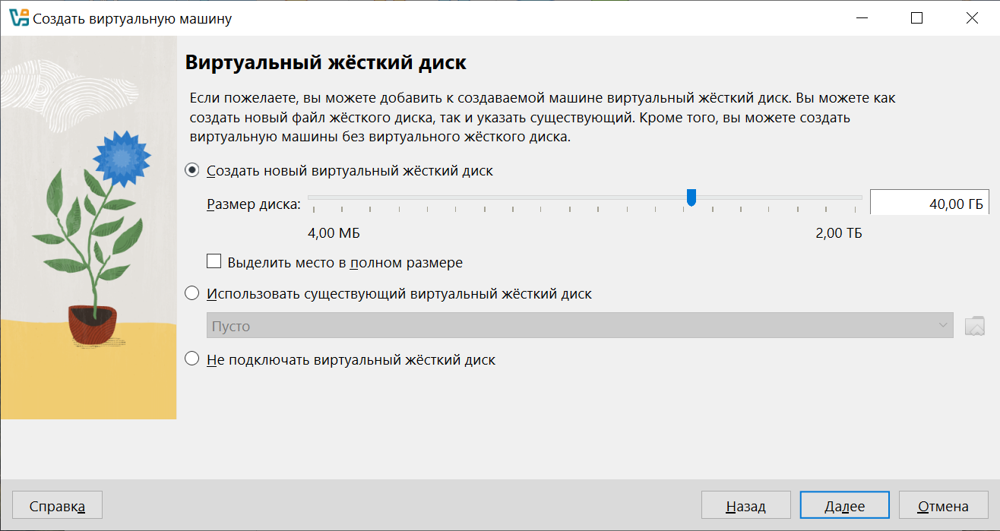{#fig:003 width=70%}

## Выполнение лабораторной работы

Начинается загрузка операционной системы (рис. 4).

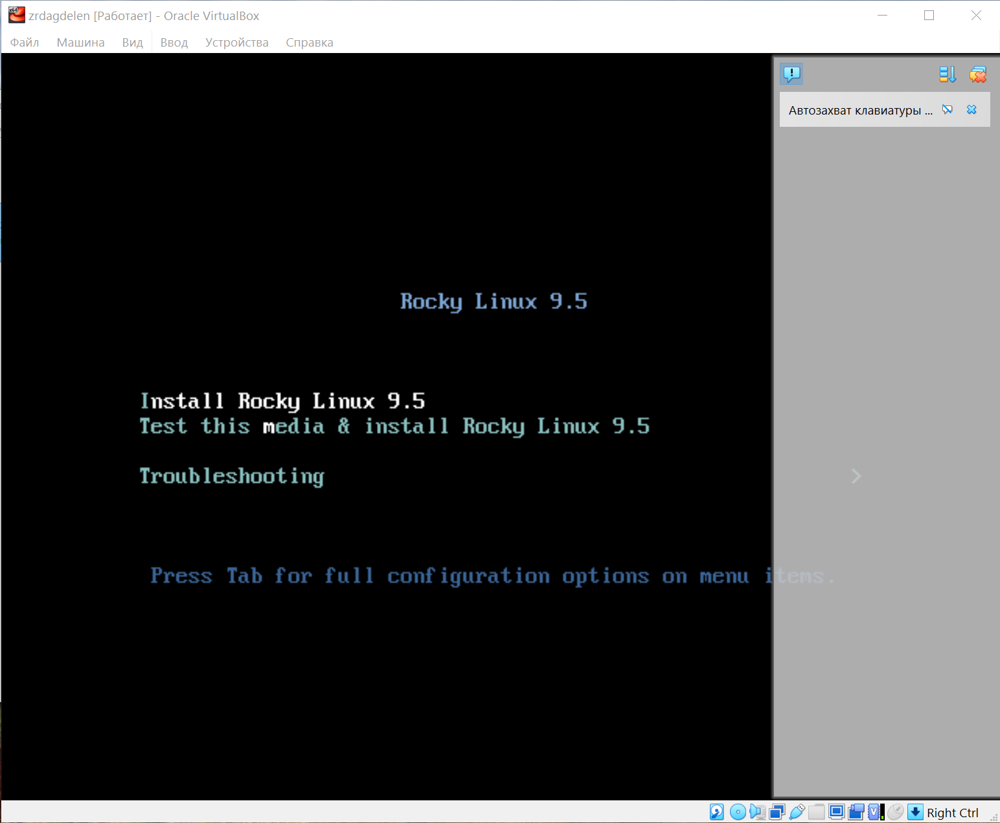{#fig:004 width=70%}

## Выполнение лабораторной работы

Выбираю нужные настройки (как требуется в лабораторной работе) (рис. 5-8).

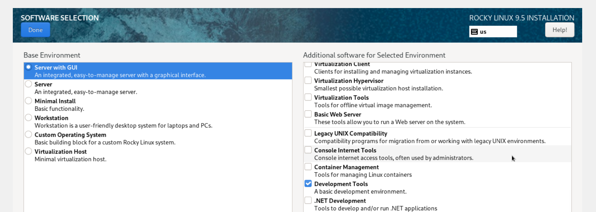{#fig:005 width=70%}

## Выполнение лабораторной работы

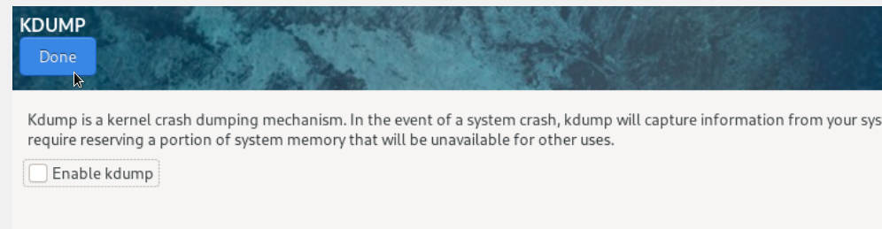{#fig:006 width=70%}

## Выполнение лабораторной работы

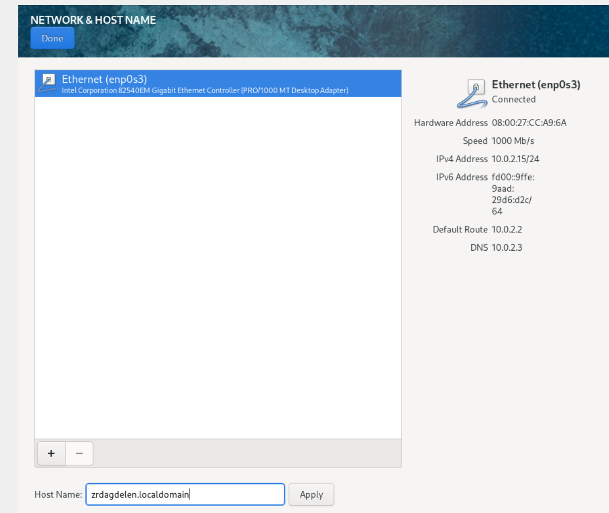{#fig:007 width=70%}

## Выполнение лабораторной работы

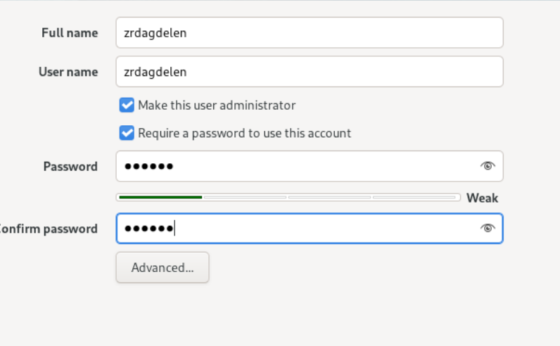{#fig:008 width=70%}

## Выполнение лабораторной работы

В итоге все скачалось и загрузилось (рис. 9).

{#fig:09 width=70%}

## Выполнение дополнительного задания

Открываю терминал, в нем прописываю dmesg | less (рис. 10).

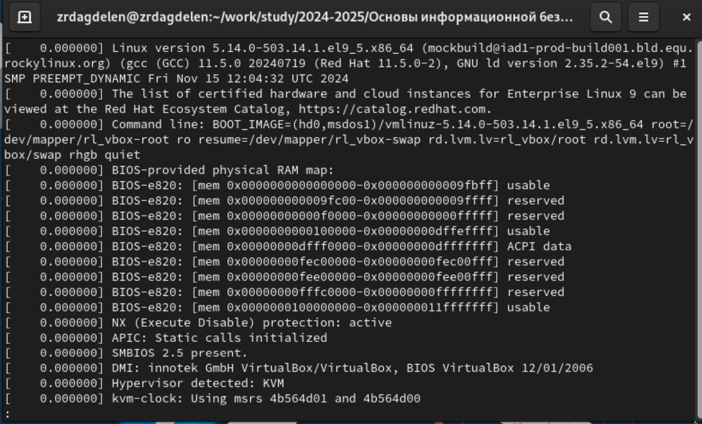{#fig:010 width=70%}

## Выполнение дополнительного задания

Версия ядра: (рис. 11).

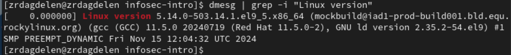{#fig:011 width=70%}

## Выполнение дополнительного задания

Частота процессора: (рис. 12).

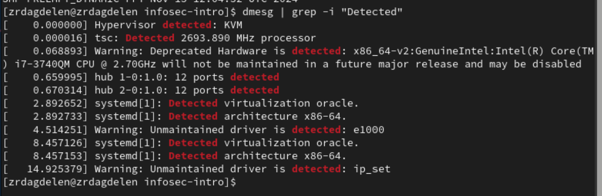{#fig:012 width=70%}

## Выполнение дополнительного задания

Модель процессора: (рис. 13).

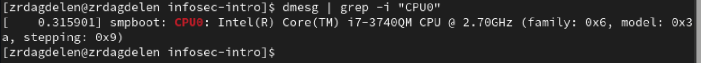{#fig:013 width=70%}

## Выполнение дополнительного задания

Доступно: (рис. 14).

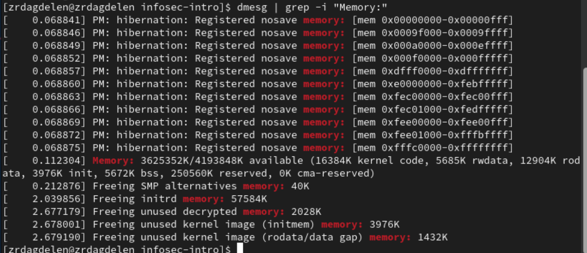{#fig:014 width=70%}

## Выполнение дополнительного задания

Обнаруженный гипервизор типа KVM (рис. 15).

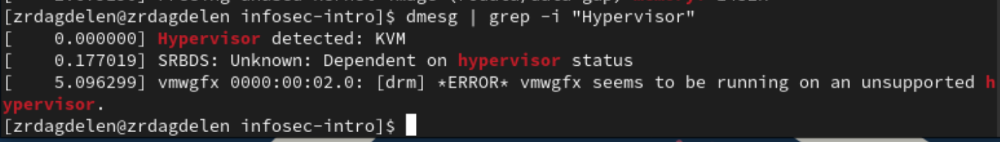{#fig:015 width=70%}

## Выполнение дополнительного задания

sudo fdish -l показывает тип файловой системы, типа Linux, Linux LVM (рис. 16).

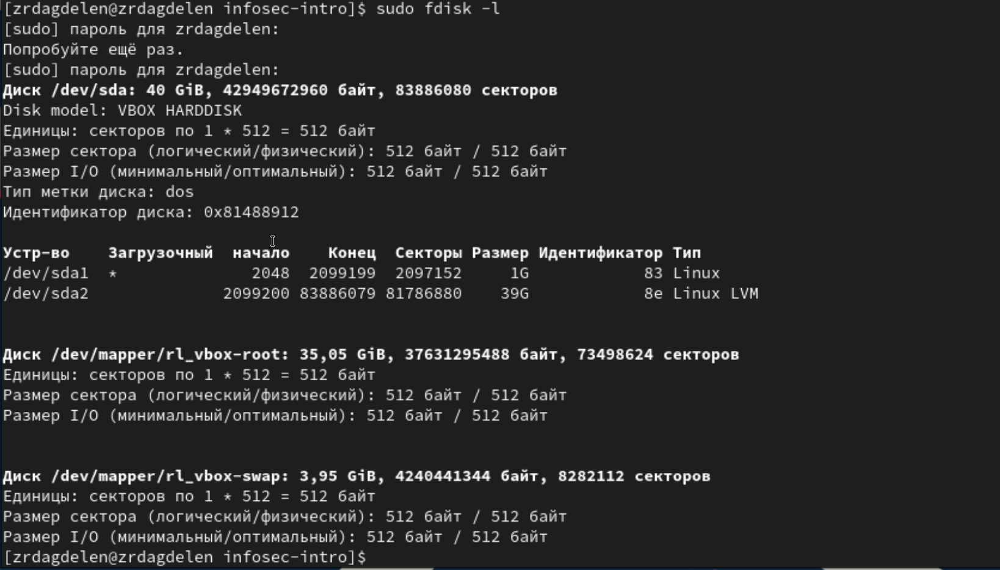{#fig:016 width=70%}

## Выполнение дополнительного задания

Далее показана последовательно монтирования файловых систем (рис. 17).

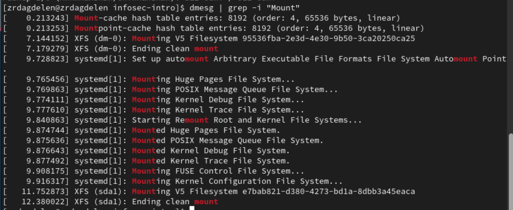{#fig:017 width=70%}

## Выводы

Я приобрела практические навыки
установки операционной системы на виртуальную машину, настройки ми-
нимально необходимых для дальнейшей работы сервисов.
