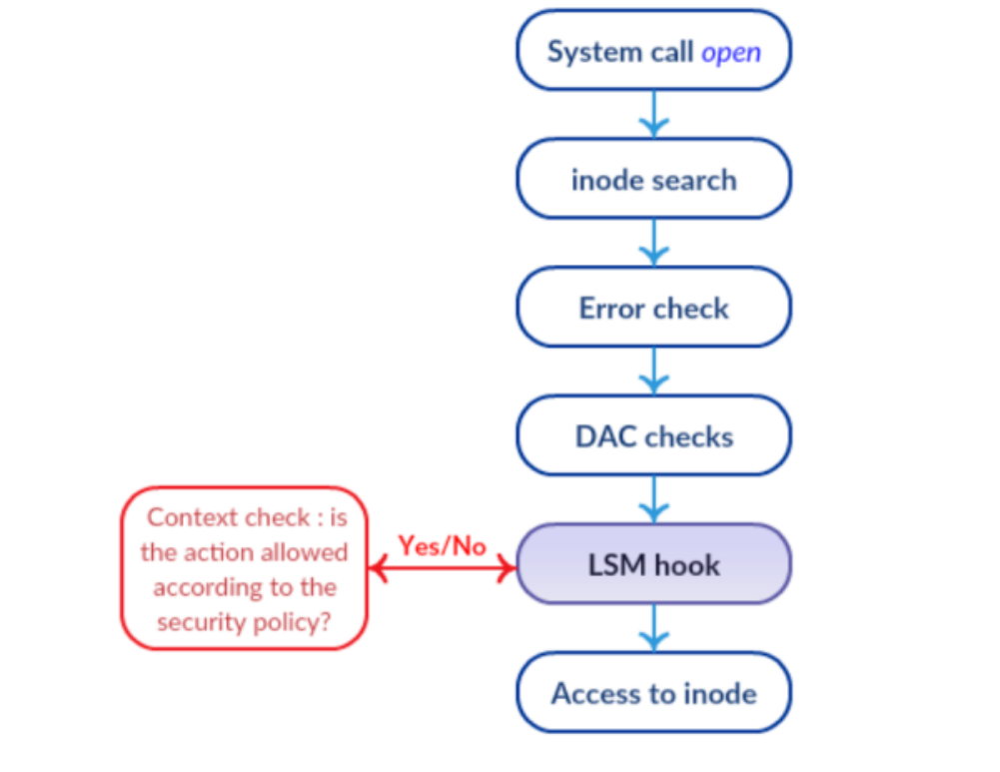
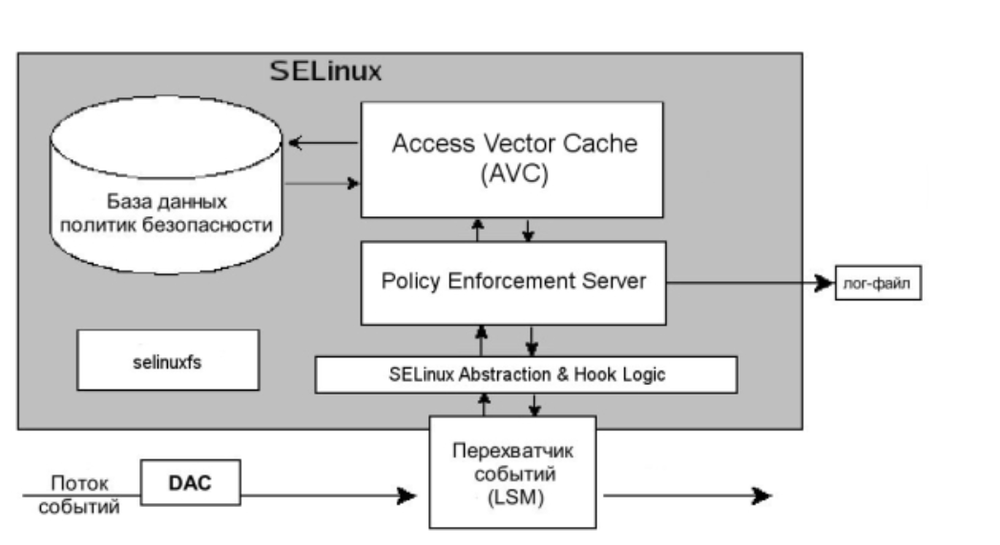
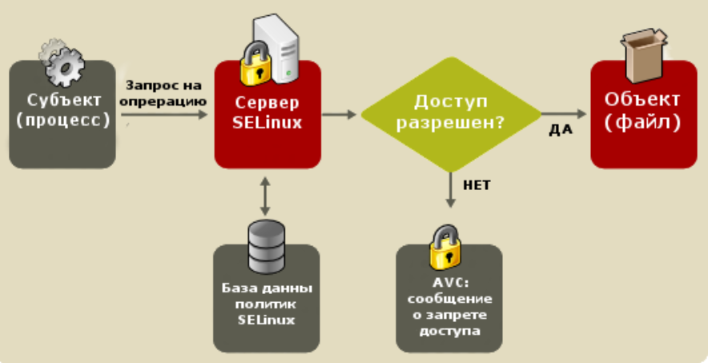
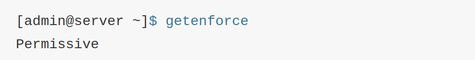
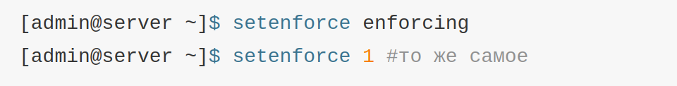
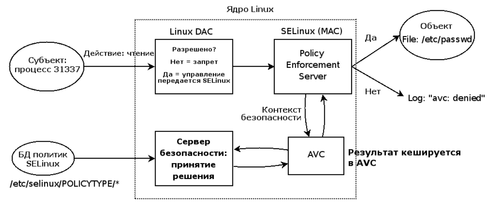

---
## Front matter
title: "Реферат по теме SELinux"
subtitle: "Основы информационной безопасности"
author: "Дагделен Зейнап Реджеповна"

## Generic otions
lang: ru-RU
toc-title: "Содержание"

## Bibliography
bibliography: bib/cite.bib
csl: pandoc/csl/gost-r-7-0-5-2008-numeric.csl

## Pdf output format
toc: true # Table of contents
toc-depth: 2
lof: true # List of figures
lot: true # List of tables
fontsize: 12pt
linestretch: 1.5
papersize: a4
documentclass: scrreprt
## I18n polyglossia
polyglossia-lang:
  name: russian
  options:
	- spelling=modern
	- babelshorthands=true
polyglossia-otherlangs:
  name: english
## I18n babel
babel-lang: russian
babel-otherlangs: english
## Fonts
mainfont: IBM Plex Serif
romanfont: IBM Plex Serif
sansfont: IBM Plex Sans
monofont: IBM Plex Mono
mathfont: STIX Two Math
mainfontoptions: Ligatures=Common,Ligatures=TeX,Scale=0.94
romanfontoptions: Ligatures=Common,Ligatures=TeX,Scale=0.94
sansfontoptions: Ligatures=Common,Ligatures=TeX,Scale=MatchLowercase,Scale=0.94
monofontoptions: Scale=MatchLowercase,Scale=0.94,FakeStretch=0.9
mathfontoptions:
## Biblatex
biblatex: true
biblio-style: "gost-numeric"
biblatexoptions:
  - parentracker=true
  - backend=biber
  - hyperref=auto
  - language=auto
  - autolang=other*
  - citestyle=gost-numeric
## Pandoc-crossref LaTeX customization
figureTitle: "Рис."
tableTitle: "Таблица"
listingTitle: "Листинг"
lofTitle: "Список иллюстраций"
lotTitle: "Список таблиц"
lolTitle: "Листинги"
## Misc options
indent: true
header-includes:
  - \usepackage{indentfirst}
  - \usepackage{float} # keep figures where there are in the text
  - \floatplacement{figure}{H} # keep figures where there are in the text
---

# Цель работы

Изучить **Security-Enhanced Linux** (SELinux), его архитектуру, принципы работы и роль в обеспечении безопасности операционных систем на базе Linux.  

# Теория

## Введение. Что такое SELinux?

**SELinux** (англ. Security-Enhanced Linux — Linux с улучшенной безопасностью) — реализация системы мандатного управления доступа, которая может работать параллельно с классической избирательной системой контроля доступа (или: это система принудительного контроля доступа, реализованная на уровне ядра).[[0]](https://ru.wikipedia.org/wiki/SELinux)

Впервые эта система появилась в четвертой версии CentOS, а в 5 и 6 версии реализация была существенно дополнена и улучшена. Эти улучшения позволили SELinux стать универсальной системой, способной эффективно решать массу актуальных задач. Стоит помнить, что классическая система прав Unix применяется первой, и управление перейдет к SELinux только в том случае, если эта первичная проверка будет успешно пройдена. [[1]](https://habr.com/ru/companies/kingservers/articles/209644/)

## История SELinux (кратко)

История SELinux (Security Enhanced Linux) начинается с работ учёных Дэвида Белла и Леонарда ЛаПадула, которые в 1973 году определили понятие безопасного состояния системы и опубликовали формальную модель, описывающую многоуровневую систему безопасности.  

В 1980-х годах работа Белла и ЛаПадула повлияла на разработку правительством США Критериев оценки надёжности компьютерных систем (TCSEC, известная как «Оранжевая книга»). TCSEC определила шесть классов оценки с постепенно возрастающими требованиями безопасности: C1, C2, B1, B2, B3 и A1.  

В 1990-х годах исследователи Агентства национальной безопасности США (NSA) работали с Secure Computing Corporation (SCC) над разработкой прочной и гибкой архитектуры контроля обязательного доступа.  [[2]](https://www.oreilly.com/library/view/selinux/0596007167/ch01s04.html)

В декабре 2000 года исследователи NSA выпустили для общественности первую версию SELinux в качестве продукта с открытым исходным кодом.[[3]](https://data-flair.training/blogs/selinux/)

В 2003 году появился фреймворк LSM для реализации подключаемых модулей безопасности, и SELinux вошёл в состав ядра 2.6.x.  [[4]](https://learning.infoteam.msk.ru/OTUS/%5BOTUS%5D%20%D0%90%D0%B4%D0%BC%D0%B8%D0%BD%D0%B8%D1%81%D1%82%D1%80%D0%B0%D1%82%D0%BE%D1%80%20Linux%20%282020%29%20%28%D0%A7%D0%B0%D1%81%D1%82%D1%8C%201-4%29%20%282020%29/17.%20SELinux%20-%20%D0%BA%D0%BE%D0%B3%D0%B4%D0%B0%20%D0%B2%D1%81%D0%B5%20%D0%B7%D0%B0%D0%BF%D1%80%D0%B5%D1%89%D0%B5%D0%BD%D0%BE/SELinux__cut_version.pdf)

Сразу же SELinux стал стандартом де-факто защищённой среды Linux и вошёл в состав наиболее популярных дистрибутивов: RedHat Enterprise Linux, Fedora, Debian, Ubuntu. [[5]](https://habr.com/ru/companies/ruvds/articles/523872/)

## Глоссарий SELinux

- **Идентичность** — Пользователь SELinux не то же самое, что и привычный Unix/Linux user id, они могут сосуществовать на одной и той же системе, но совершенно различны по сути. Каждая стандартная учетная запись Linux может соответствовать одному или нескольким в SELinux. Идентичность SELinux является составной частью общего контекста безопасности, который определяет в какие домены можно входить, а в какие — нельзя.
- **Домены** — В SELinux домен является контекстом выполнения субъекта, т. е. процесса. Домен напрямую определяет доступ, который имеет процесс. Домен — это в основном список того, что могут делать процессы или какие действия процесс может выполнять с разными типами. Некоторые примеры доменов: sysadm_t для системного администрирования, и user_t, который является обычным непривилегированным доменом пользователя. Система инициализации init запускается в домене init_t, а процесс named запускается в домене named_t.
- **Роли** — То, что служит посредником между доменами и пользователями SELinux. Роли определяют, в каких доменах может состоять пользователь и к каким типам объектов он сможет получить доступ. Подобный механизм разграничения доступов предотвращает угрозу осуществить атаку повышения привилегий. Роли вписаны в модель безопасности Role Based Access Control (RBAC), используемой в SELinux.
- **Типы** — Атрибут списка Type Enforcement, который назначается объекту и определяет, кто получит к нему доступ. Похоже на определение домена, за исключением того, что домен применяется к процессу, а тип применяется к таким объектам, как каталоги, файлы, сокеты и т. д.
- **Субъекты и объекты** — Процессы являются субъектами и запускаются в определенном контексте, или домене безопасности. Ресурсы операционной системы: файлы, директории, сокеты и пр., являются объектами, которым ставится в соответствие определенный тип, иначе говоря — уровень секретности.
- **Политики SELinux** — Для защиты системы SELinux использует разнообразные политики. Политика SELinux определяет доступ пользователей к ролям, ролей — к доменам и доменов — к типам. В начале пользователь авторизуется для получения роли, далее роль авторизуется для доступа к доменам. Наконец домен может иметь доступ лишь к некоторым типам объектов. [[5]](https://habr.com/ru/companies/ruvds/articles/523872/)

## LSM и архитектура SELinux

LSM (англ. Linux Security Modules — модули безопасности Linux) представляют собой реализацию в виде подгружаемых модулей ядра. В первую очередь, LSM применяются для поддержки контроля доступа. Сами по себе LSM не обеспечивают систему какой-то дополнительной безопасностью, а лишь являются неким интерфейсом для её поддержки. Система LSM обеспечивает реализацию функций перехватчиков, которые хранятся в структуре политик безопасности, охватывающей основные операции, защиту которых необходимо обеспечить. Контроль доступа в систему осуществляется благодаря настроенным политикам.[[7]](https://ru.wikipedia.org/wiki/SELinux#%D0%92%D0%BD%D1%83%D1%82%D1%80%D0%B5%D0%BD%D0%BD%D1%8F%D1%8F_%D0%B0%D1%80%D1%85%D0%B8%D1%82%D0%B5%D0%BA%D1%82%D1%83%D1%80%D0%B0_SELinux)

Несмотря на название LSM в общем-то не являются загружаемыми модулями Linux. Однако также, как и SELinux, он непосредственно интегрирован в ядро. Любое изменение исходного кода LSM требует новой компиляции ядра. Соответствующая опция должна быть включена в настройках ядра, иначе код LSM не будет активирован после загрузки. Но даже в этом случае его можно включить опцией загрузчика ОС (рис. [-@fig:000]):

{#fig:000 width=70%}

LSM оснащен хуками в основных функций ядра, которые могут быть релевантными для проверок. Одна из основных особенностей LSM состоит в том, что они устроены по принципу стека. Таким образом, стандартные проверки по-прежнему выполняются, и каждый слой LSM лишь добавляет дополнительные элементы управления и контроля. Это означает, что запрет невозможно откатить назад. Это показано на рисунке, если результатом рутинных DAC проверок станет отказ, то дело даже не дойдет до хуков LSM.

SELinux перенял архитектуру безопасности Flask исследовательской операционной системы Fluke, в частности принцип наименьших привилегий. Суть этой концепции, как следует из их названия, в предоставлении пользователю или процессу лишь тех прав, которые необходимы для осуществления предполагаемых действий. Данный принцип реализован с помощью принудительной типизации доступа, таким образом контроль допусков в SELinux базируется на модели домен => тип.

Благодаря принудительной типизации доступа SELinux имеет гораздо более значительные возможности по разграничению доступа, нежели традиционная модель DAC, используемая в ОС Unix/Linux. К примеру, можно ограничить номер сетевого порта, который будет случать ftp сервер, разрешить запись и изменения файлов в определенной папке, но не их удаление.

## Основные компоненты SELinux

Основные компоненты SELinux таковы [[5]](https://habr.com/ru/companies/ruvds/articles/523872/):
- Policy Enforcement Server — Основной механизм организации контроля доступа.
- БД политик безопасности системы.
- Взаимодействие с перехватчиком событий LSM.
- Selinuxfs — Псевдо-ФС, такая же, как /proc и примонтированная в /sys/fs/selinux. Динамически заполняется ядром Linux во время выполнения и содержит файлы, содержащие сведения о статусе SELinux.
- Access Vector Cache — Вспомогательный механизм повышения производительности.

Все это работает следующим образом (рис. [-@fig:001]):

{#fig:001 width=70%}

1. Некий субъект, в терминах SELinux, выполняет над объектом разрешенное действие после DAC проверки, как показано не верхней картинке. Этот запрос на выполнение операции попадает к перехватчику событий LSM.
2. Оттуда запрос вместе с контекстом безопасности субъекта и объекта передается на модуль SELinux Abstraction and Hook Logic, ответственный за взаимодействие с LSM.
3. Инстанцией принятия решения о доступе субъекта к объекту является Policy Enforcement Server и к нему поступают данные от SELinux AnHL.
4. Для принятия решения о доступе, или запрете Policy Enforcement Server обращается к подсистеме кэширования наиболее используемых правил Access Vector Cache (AVC).
5. Если решение для соответствующего правила не найден в кэше, то запрос передается дальше в БД политик безопасности.
6. Результат поиска из БД и AVC возвращается в Policy Enforcement Server.
7. Если найденная политика согласуется с запрашиваемым действием, то операция разрешается. В противном случае операция запрещается.

## Методы управления доступом

Большинство операционных систем обладают средствами и методами управления доступом, которые в свою очередь определяют, может ли некий объект на уровне операционной системы (пользователь или программа) получить доступ к определённому ресурсу. Используются следующие методы управления доступом[[7]](https://ru.wikipedia.org/wiki/SELinux#%D0%92%D0%BD%D1%83%D1%82%D1%80%D0%B5%D0%BD%D0%BD%D1%8F%D1%8F_%D0%B0%D1%80%D1%85%D0%B8%D1%82%D0%B5%D0%BA%D1%82%D1%83%D1%80%D0%B0_SELinux)
:

1. **Дискреционный контроль доступа** (англ. Discretionary Access Control, DAC). Данный метод реализует ограничение доступа к объектам на основе групп, к которым они принадлежат. В Linux, в основе этого метода, лежит стандартная модель контроля доступа к файлам. Права доступа определены для следующих категорий: пользователь (владелец файла), группа (все пользователи, которые являются членами группы), другие (все пользователи, которые не являются ни владельцами файла, ни членами группы). Причем к каждой из групп предоставляются следующие права: права на запись, на чтение и на исполнение.

2. **Мандатное управление доступом** (англ. Mandatory Access Control, MAC). Главным образом суть этого метода заключается в установлении определённых прав доступа субъекта к определённым объектам. В ОС реализовано следующее: программа обладает только теми возможностями, которые необходимы ей для выполнения своих задач, и не более того. Данный метод имеет преимущество в сравнении с предыдущим; если в программе будет обнаружена уязвимость, то возможности её доступа будут весьма ограничены.

3. **Контроль доступа на основе ролей** (англ. Role-Based Access Control, RBAC). Права доступа реализованы в виде ролей, выдаваемых системой безопасности. Роли представляют собой определённые полномочия на выполнение конкретных действий группой субъектов над объектами в системе. Данная политика является улучшением дискреционного контроля доступа. *Роли в SELinux по-умолчанию:*
	- *user_r* - роль обычного пользователя, разрешает запуск
пользовательских приложений и других непривилегированных
доменов
	- *staff_r* - похожа на роль user_r, но позволяет получать больше
системной информации, чем обычный пользователь, эта роль
выдается пользователям, которым следует разрешить
переключение на другие роли
	- *sysadm_r* - административная роль, разрешает использование
большинства доменов, включая привилегированные
	- *system_r* - системная роль, не предназначенная для
непосредственного переключения

## Решение проблем традиционной модели безопасности.

SELinux следует модели минимально необходимых привилегий для каждого сервиса, пользователя и программы намного более строго. По умолчанию установлен «запретительный режим», когда каждый элемент системы имеет только те права, которые жизненно необходимы ему для функционирования. Если же пользователь, программа или сервис пытаются изменить файл или получить доступ к ресурсу, который явно не необходим для решения их, то им будет просто отказано в доступе, а такая попытка будет зарегистрирована в журнале (рис. [-@fig:002]).

{#fig:002 width=70%}

SELinux реализована на уровне ядра, так что прикладные приложения могут совсем ничего не знать о версии этой системы принудительного контроля доступа, особенностях её работы и т.д. В случае грамотной настройки, SELinux никак не повлияет на функционирование сторонних программ и сервисов. Хотя, если приложение способно перехватывать сообщения об ошибках этой системы контроля доступа, удобство пользования таки приложением существенно возрастает. Ведь в случае попытки доступа к защищенному ресурсу или файлу, SELinux передает в основное приложение ошибку из семейства «access denied». Но лишь немногие приложения используют получаемые от SELinux коды возврата системных вызовов.

Вот несколько примеров использования SELinux, которые позволяют увидеть, каким образом можно увеличить степень безопасности всей системы:

- Создание и настройка списка программ, которые могут читать ssh-ключи.

- Предотвращение несанкционированного доступа к данным через mail-клиент.

- Настройка браузера таким образом, чтобы он мог читать в домашней папки пользователя только необходимые для функционирования файлы и папки. [[1]](https://habr.com/ru/companies/kingservers/articles/209644/)

## Управление настройками SELinux (режимы работы)

SELinux или Security Enhanced Linux — это улучшенный механизм управления доступом, разработанный Агентством национальной безопасности США (АНБ США) для предотвращения злонамеренных вторжений. Он реализует принудительную (или мандатную) модель управления доступом (англ. Mandatory Access Control, MAC) поверх существующей дискреционной (или избирательной) модели (англ. Discretionary Access Control, DAC), то есть разрешений на чтение, запись, выполнение. [[6]](https://habr.com/ru/companies/otus/articles/460387/)

SELinux имеет три основных режим работы, при этом по умолчанию установлен режим Enforcing. Это довольно жесткий режим, и в случае необходимости он может быть изменен на более удобный для конечного пользователя. [[1]](https://habr.com/ru/companies/kingservers/articles/209644/)

1. Enforcing: Режим по-умолчанию. При выборе этого режима все действия, которые каким-то образом нарушают текущую политику безопасности, будут блокироваться, а попытка нарушения будет зафиксирована в журнале.

2. Permissive: В случае использования этого режима, информация о всех действиях, которые нарушают текущую политику безопасности, будут зафиксированы в журнале, но сами действия не будут заблокированы.

3. Disabled: Полное отключение системы принудительного контроля доступа. 

По умолчанию настройки находятся в `/etc/selinux/config`

Посмотреть в каком режиме находится SELinux можно следующей командой (рис. [-@fig:003])

{#fig:003 width=70%}

Изменение режима до перезагрузки, например выставить на enforcing, или 1. Параметру permissive соответствует числовой код 0 (рис. [-@fig:004]).

{#fig:004 width=70%}

Также изменить режим можно правкой файла. Для отключения надо изменить параметр SELINUX следующим образом: SELINUX=disabled.

## Политики SELinux

Как отмечалось ранее, SELinux по-умолчанию работает в режиме Enforcing, когда любые действия, кроме разрешенных, автоматически блокируются, каждая программа, пользователь или сервис обладают только теми привилегиями, которые необходимы им для функционирования, но не более того. Это довольно жесткая политика, которая обладает как плюсами — наибольший уровень информационной безопасности, так и минусами — конфигурирование системы в таком режиме сопряжено с большими трудозатратами системных администраторов, к тому же, велик риск того, что пользователи столкнутся с ограничением доступа, если захотят использовать систему хоть сколько-нибудь нетривиальным образом. Такой подход допустим в Enterprise-секторе, но неприемлем на компьютерах конечных пользователей. Многие администраторы просто отключают SELinux на рабочих станциях, чтобы не сталкиваться с подобными проблемами(рис. [-@fig:005]).

{#fig:005 width=70%}

Для того, чтобы избежать этого, для ключевых приложений и сервисов, таких как, например, httpd, named, dhcpd, mysqld, определены заранее сконфигурированные целевые политики, которые не позволят получить злоумышленнику доступ к важным данным. Те же приложения, для которых политика не определена, выполняются в домене unconfined_t и не защищаются SELinux. Таким образом, правильно выбранные целевые политики позволяют добиться приемлемого уровня безопасности, не создав при этом для пользователя лишних проблем. [[1]](https://habr.com/ru/companies/kingservers/articles/209644/)

# Выводы

Мы изучили SELinux.

# Список литературы

1. Wikipedia. SELinux[[0]](https://ru.wikipedia.org/wiki/SELinux)
2. SELinux – описание и особенности работы с системой. Часть 1[[1]](https://habr.com/ru/companies/kingservers/articles/209644/)
3. SELinux History[[2]](https://www.oreilly.com/library/view/selinux/0596007167/ch01s04.html)
4. SELinux – Security Enhanced Linux[[3]](https://data-flair.training/blogs/selinux/)
5. Вебинар. SELinux[[4]](https://learning.infoteam.msk.ru/OTUS/%5BOTUS%5D%20%D0%90%D0%B4%D0%BC%D0%B8%D0%BD%D0%B8%D1%81%D1%82%D1%80%D0%B0%D1%82%D0%BE%D1%80%20Linux%20%282020%29%20%28%D0%A7%D0%B0%D1%81%D1%82%D1%8C%201-4%29%20%282020%29/17.%20SELinux%20-%20%D0%BA%D0%BE%D0%B3%D0%B4%D0%B0%20%D0%B2%D1%81%D0%B5%20%D0%B7%D0%B0%D0%BF%D1%80%D0%B5%D1%89%D0%B5%D0%BD%D0%BE/SELinux__cut_version.pdf)
6. Системы защиты Linux[[5]](https://habr.com/ru/companies/ruvds/articles/523872/)
7. Руководство для начинающих по SELinux[[6]](https://habr.com/ru/companies/otus/articles/460387/)
8. Wikipedia. Внутренняя архитектура SELinux[[7]](https://ru.wikipedia.org/wiki/SELinux#%D0%92%D0%BD%D1%83%D1%82%D1%80%D0%B5%D0%BD%D0%BD%D1%8F%D1%8F_%D0%B0%D1%80%D1%85%D0%B8%D1%82%D0%B5%D0%BA%D1%82%D1%83%D1%80%D0%B0_SELinux)
