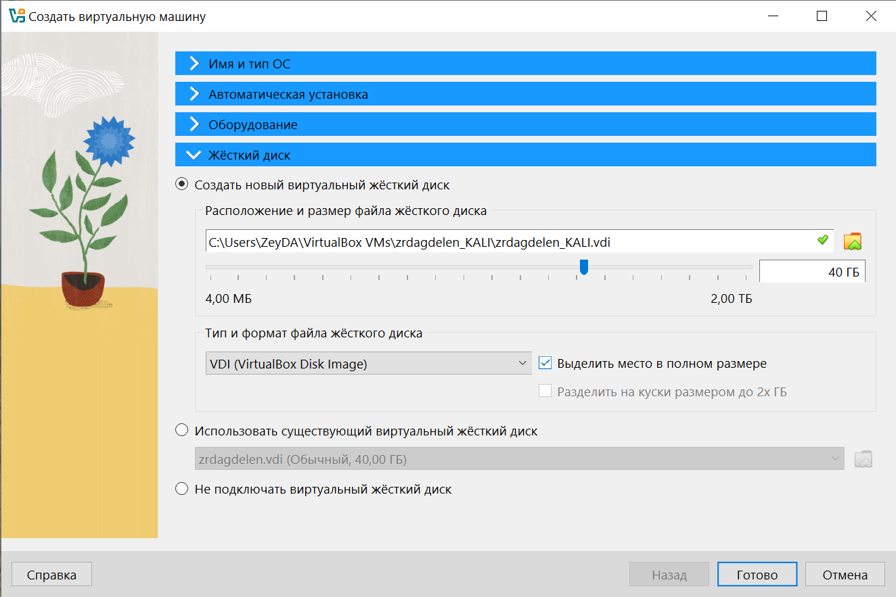
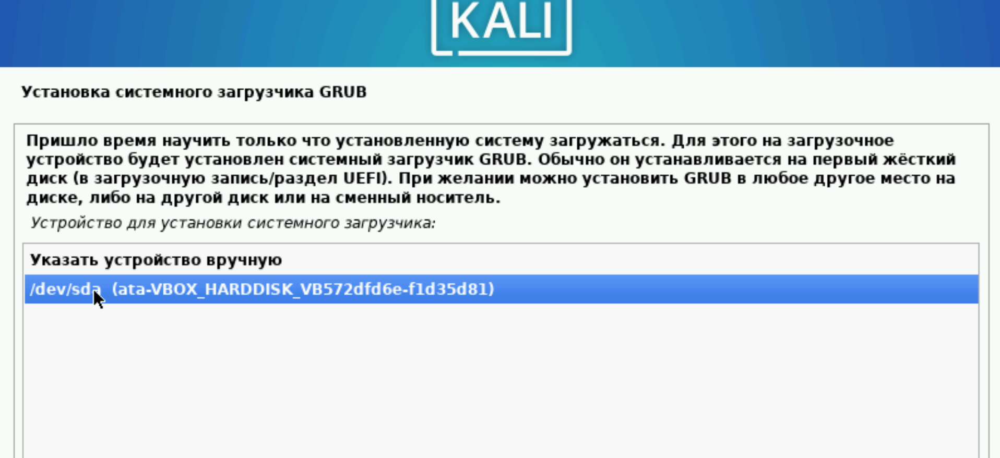
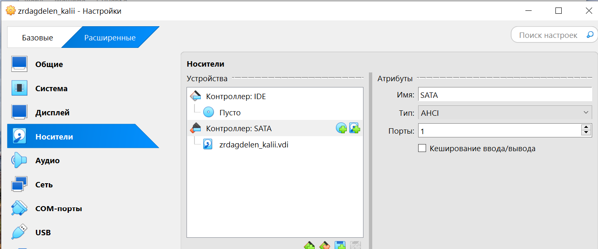

---
## Front matter
lang: ru-RU
title: Индивидуальный проект. Этап 1.
subtitle: Установка Kali Linux на Virtualbox
author:
  - Дагделен З. Р.
institute:
  - Российский университет дружбы народов, Москва, Россия
  
date: 27 февраля 2025

## i18n babel
babel-lang: russian
babel-otherlangs: english

## Formatting pdf
toc: false
toc-title: Содержание
slide_level: 2
aspectratio: 169
section-titles: true
theme: metropolis
header-includes:
 - \metroset{progressbar=frametitle,sectionpage=progressbar,numbering=fraction}
 - '\makeatletter'
 - '\beamer@ignorenonframefalse'
 - '\makeatother'
---

## Докладчик

:::::::::::::: {.columns align=center}
::: {.column width="70%"}

  * Дагделен Зейнап Реджеповна
  * студентка из группы НКАбд-02-23
  * Факультет физико-математических и естественных наук
  * Российский университет дружбы народов
  * [1132236052@rudn.ru](mailto:1132236052@pfur.ru)

:::
::: {.column width="50%"}

:::
::::::::::::::

## Цель

Приобретение практических навыков по установке операционной системы Linux на виртуальную машину.

## Задание

1. Установить дистрибутив Kali Linux на виртуальную машину VirtualBox.

## Выполнение лабораторной работы

Открываю VirtualBox(рис. 1).

{#fig:001 width=70%}

## Выполнение лабораторной работы

Настраиваю основную память и количество выделяемых процессоров(рис. 2).

{#fig:002 width=70%}

## Выполнение лабораторной работы

Настраиваю размер виртуального жесткого диска, выбираю 40ГБ (рис. 3).

{#fig:003 width=70%}

## Выполнение лабораторной работы

В окне установки Kali выбираю графическую установку (рис. 4).

{#fig:004 width=70%}

## Выполнение лабораторной работы

Выбираю язык, на котором будет установка (рис. 5).

{#fig:005 width=70%}

## Выполнение лабораторной работы

Ввожу имя компьютера (рис. 6).

{#fig:006 width=70%}

## Выполнение лабораторной работы

Ввожу имя домена (рис. 7).

{#fig:007 width=70%}

## Выполнение лабораторной работы

Ввожу имя пользователя, у которой будут права суперпользователя (рис. 9).

{#fig:009 width=70%}

## Выполнение лабораторной работы

Ввожу пароль для созданного пользователя (рис. 10).

{#fig:010 width=70%}

## Выполнение лабораторной работы

Теперь установщик проверяет диски и предлагает различные варианты,
в зависимости от настроек. Созданный виртуальный диск чистый, поэтому
я выбираю «весь диск» (рис. 11).

{#fig:011 width=70%}

## Выполнение лабораторной работы

Подтверждаю установку системного загрузчика GRUB (Загрузчик
операционной системы от проекта GNU программа для управления
процессом загрузки), также выбираю виртуальный диск, на который
устанавливать GRUB  (рис. 12).

{#fig:012 width=70%}

## Выполнение лабораторной работы

Завершаю установку.

Проверяю, что в носителях теперь пусто (рис. 13).

{#fig:013 width=70%}

## Выполнение лабораторной работы

Вхожу в систему от имени своего пользователя (рис. 21).

{#fig:021 width=70%}

Это успех!

# Выводы

Приобрела практические навыки по установке операционной системы Linux на виртуальную машину. Установила дистрибутив Kali LInux на VirtualBox.

:::
