---
## Front matter
title: "Отчет. 1 этап индивидуального проекта."
subtitle: "Основы информационной безопасности"
author: "Дагделен Зейнап Реджеповна НКАбд-02-23"

## Generic otions
lang: ru-RU
toc-title: "Содержание"

## Bibliography
bibliography: bib/cite.bib
csl: pandoc/csl/gost-r-7-0-5-2008-numeric.csl

## Pdf output format
toc: true # Table of contents
toc-depth: 2
lof: true # List of figures
lot: true # List of tables
fontsize: 12pt
linestretch: 1.5
papersize: a4
documentclass: scrreprt
## I18n polyglossia
polyglossia-lang:
  name: russian
  options:
	- spelling=modern
	- babelshorthands=true
polyglossia-otherlangs:
  name: english
## I18n babel
babel-lang: russian
babel-otherlangs: english
## Fonts
mainfont: PT Serif
romanfont: PT Serif
sansfont: PT Sans
monofont: PT Mono
mainfontoptions: Ligatures=TeX
romanfontoptions: Ligatures=TeX
sansfontoptions: Ligatures=TeX,Scale=MatchLowercase
monofontoptions: Scale=MatchLowercase,Scale=0.9
## Biblatex
biblatex: true
biblio-style: "gost-numeric"
biblatexoptions:
  - parentracker=true
  - backend=biber
  - hyperref=auto
  - language=auto
  - autolang=other*
  - citestyle=gost-numeric
## Pandoc-crossref LaTeX customization
figureTitle: "Рис."
tableTitle: "Таблица"
listingTitle: "Листинг"
lofTitle: "Список иллюстраций"
lotTitle: "Список таблиц"
lolTitle: "Листинги"
## Misc options
indent: true
header-includes:
  - \usepackage{indentfirst}
  - \usepackage{float} # keep figures where there are in the text
  - \floatplacement{figure}{H} # keep figures where there are in the text
---

# Цель работы

Приобретение практических навыков по установке операционной системы Linux на виртуальную машину.

# Задание

1. Установить дистрибутив Kali Linux на виртуальную машину VirtualBox.

# Теоретическое введение

Kali Linux — это дистрибутив Linux на основе Debian с открытым исходным кодом, предназначенный для расширенного тестирования на проникновение, проверки уязвимостей, аудита безопасности систем и сетей.

**Сферы применения дистрибутива**:

- Тестирование на проникновение. Kali Linux широко используется в области тестирования безопасности, чтобы оценить уязвимости в компьютерных системах, сетях и приложениях. ОС предоставляет множество инструментов для обнаружения уязвимостей.

- Цифровое расследование. Дистрибутив предоставляет инструменты для сбора и анализа цифровых данных, включая восстановление удаленных файлов, извлечение метаданных, анализ системных журналов и т.д.

- Обратная разработка. Kali Linux содержит инструменты, которые помогают разработчикам анализировать готовое программное обеспечение, чтобы понять его работу, выявить уязвимости или разработать альтернативные реализации.

- Безопасность беспроводных сетей. У ОС есть набор инструментов для проверки и обеспечения безопасности беспроводных сетей. Kali Linux поддерживает анализ беспроводных протоколов, перехват и дешифрование сетевого трафика, а также атаки на беспроводные сети.

- Защита информации. Kali Linux также может использоваться для обеспечения безопасности информации, включая мониторинг сетевой активности, обнаружение вторжений, защиту от DDoS-атак и настройку брандмауэров.

# Выполнение лабораторной работы

Открываю VirtualBox, нажимаю `создать`, в появившемся окне выбираю тип операционной системы Linux, версия - Other Linux, задаю имя машины, подключаю ранее скачанный образ диска(рис. 1).

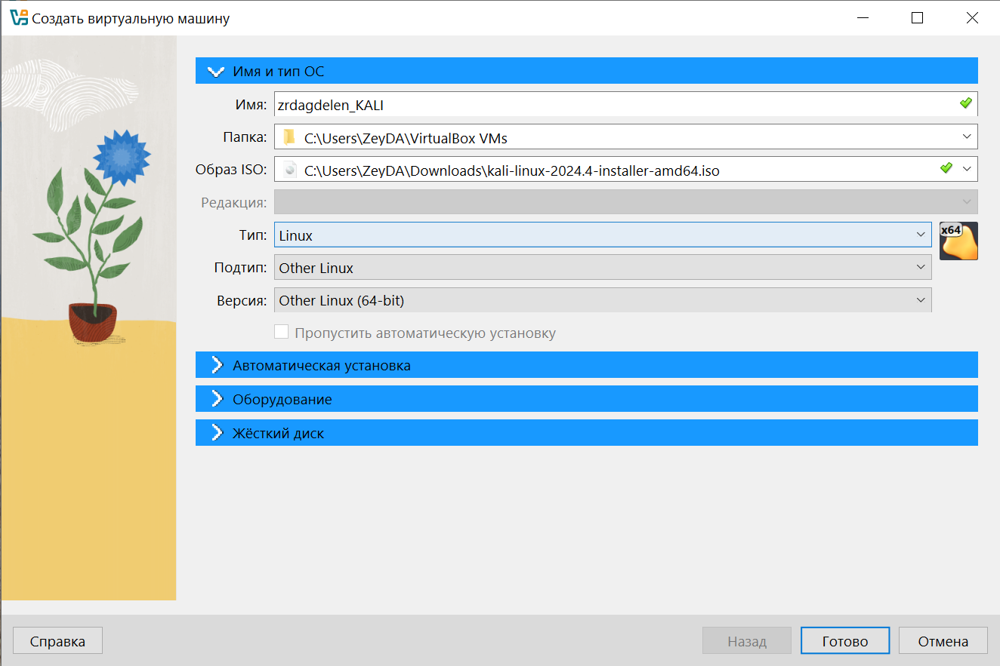{#fig:001 width=70%}

Настраиваю основную память и количество выделяемых процессоров, необходимое для работы без помех (рис. 2).

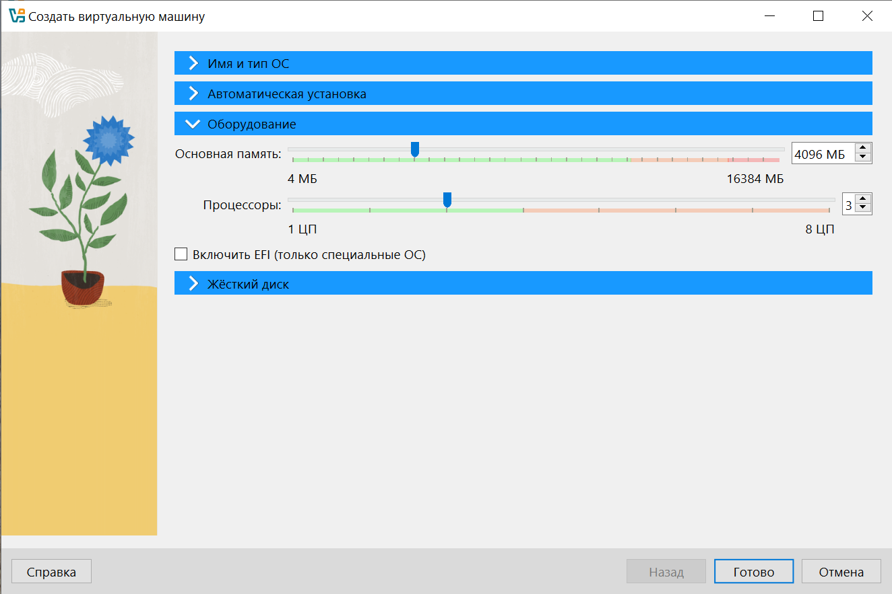{#fig:002 width=70%}

Настраиваю размер виртуального жесткого диска, выбираю 40ГБ (рис. 3).

{#fig:003 width=70%}

В окне установки Kali выбираю графическую установку (рис. 4).

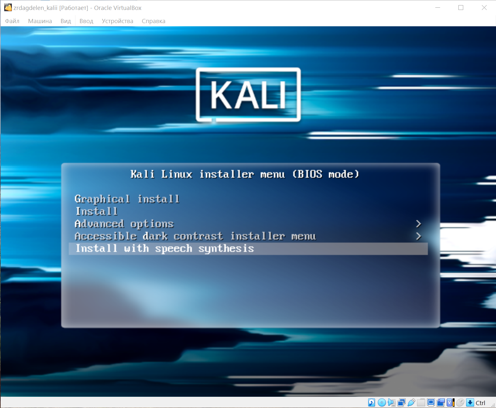{#fig:004 width=70%}

Выбираю язык, на котором будет установка (рис. 5).

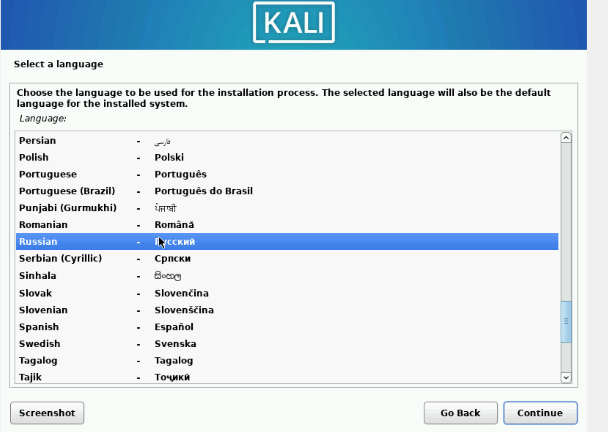{#fig:005 width=70%}

Выбираю раскладку клавиатуры (рис. 6).

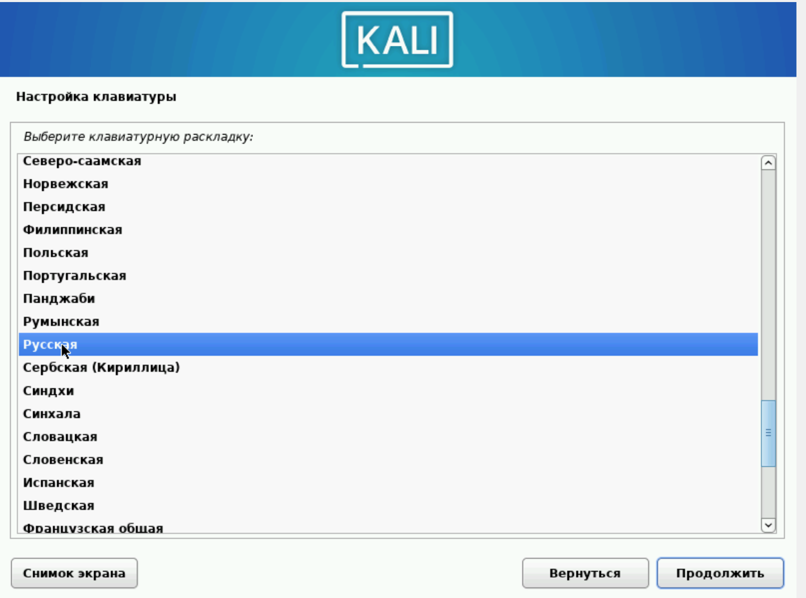{#fig:006 width=70%}

Выбираю комбинацию горячих клавиш для переключения раскладки клавиатуры (рис. 7).

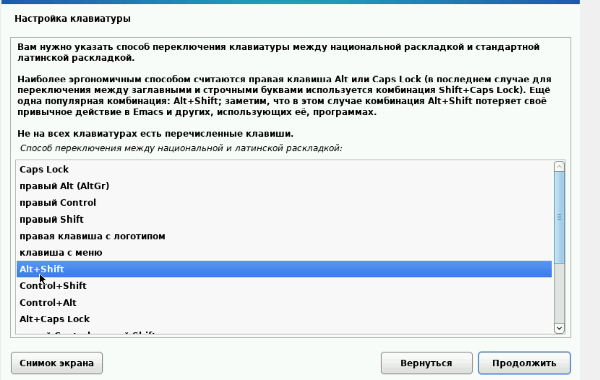{#fig:007 width=70%}

Ввожу имя компьютера (рис. 8).

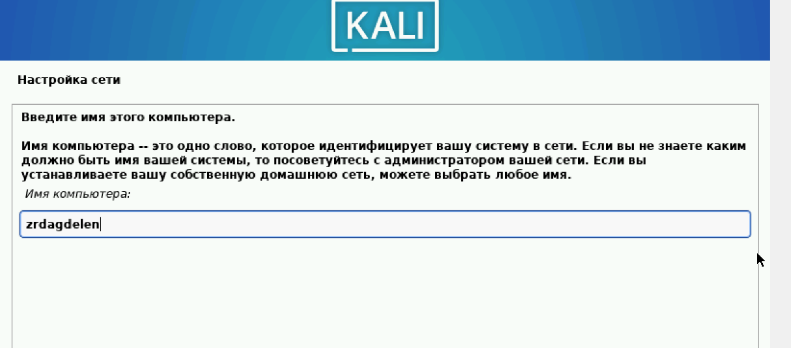{#fig:008 width=70%}

Ввожу имя домена (рис. 9).

{#fig:009 width=70%}

Ввожу имя пользователя, у которой будут права суперпользователя (рис. 10).

{#fig:010 width=70%}

Ввожу пароль для созданного пользователя (рис. 11).

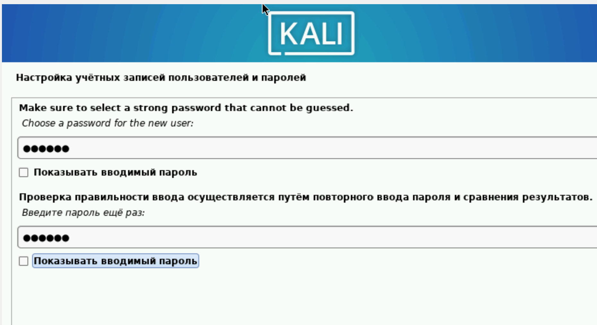{#fig:011 width=70%}

Выбираю часовой пояс (рис. 12).

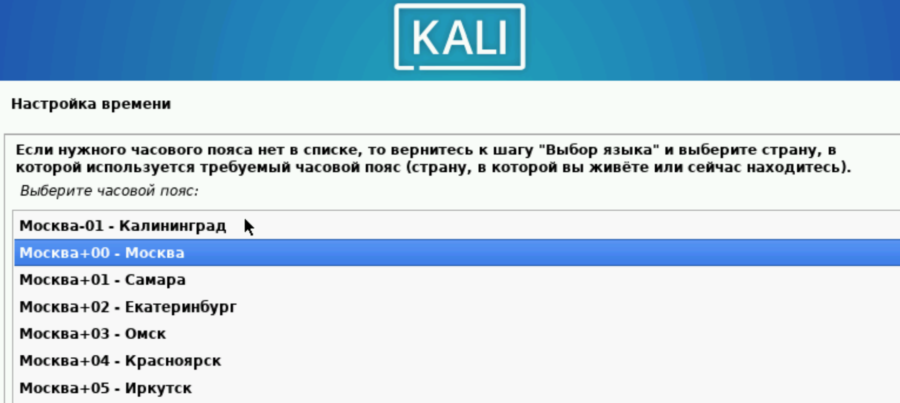{#fig:012 width=70%}

Теперь установщик проверяет диски и предлагает различные варианты,
в зависимости от настроек. Созданный виртуальный диск чистый, поэтому
я выбираю «весь диск» (рис. 13).

{#fig:013 width=70%}

Убеждаюсь, что выбран нужный виртуальный диск, продолжаю
настройку разметки дисков (рис. 14).

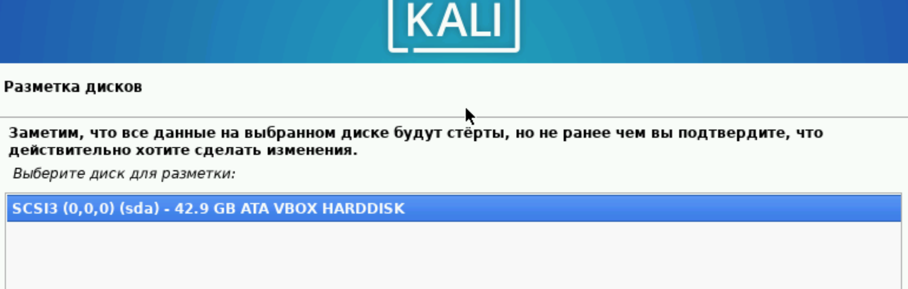{#fig:014 width=70%}

Далее установщик предлагает выбрать схему разметки, ее я оставляю по
умолчанию «все файлы в одном разделе» (рис. 15).

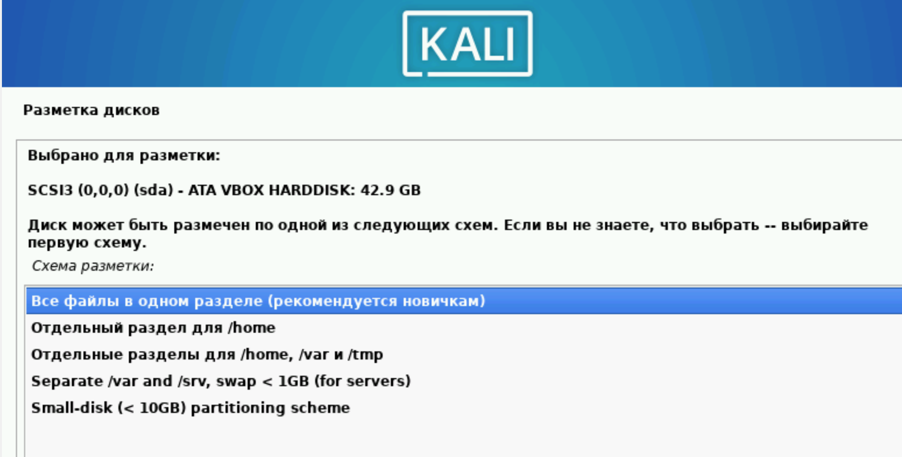{#fig:015 width=70%}

После этого этапа надо подтвердить
окончание разметки дисков, чтобы изменения были записаны (рис. 16).

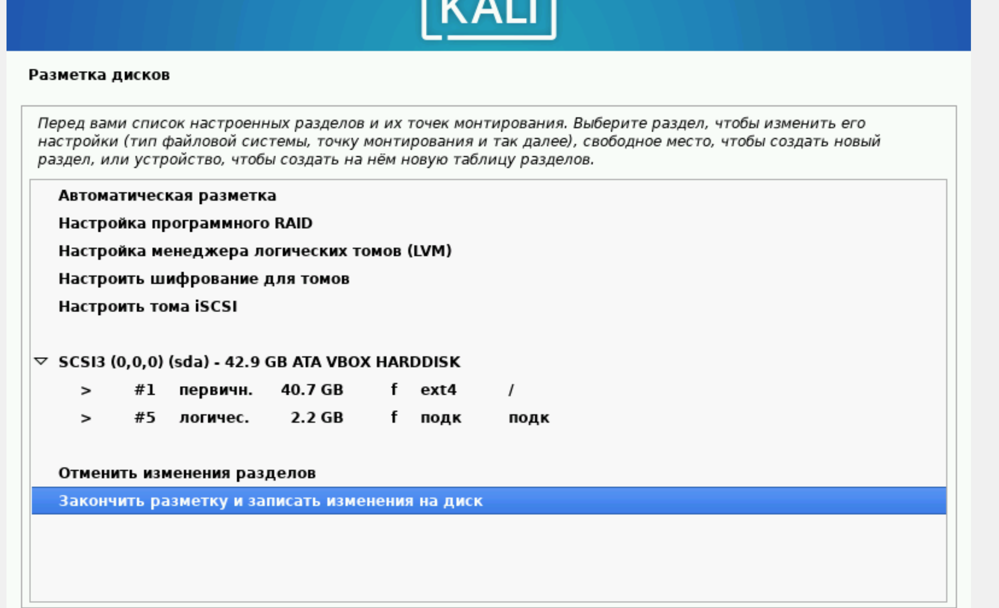{#fig:016 width=70%}

Затем установщик дает еще раз просмотреть конфигурацию диска,
прежде чем внести необратимые изменения (рис. 17). После этого этапа
начнется установка.

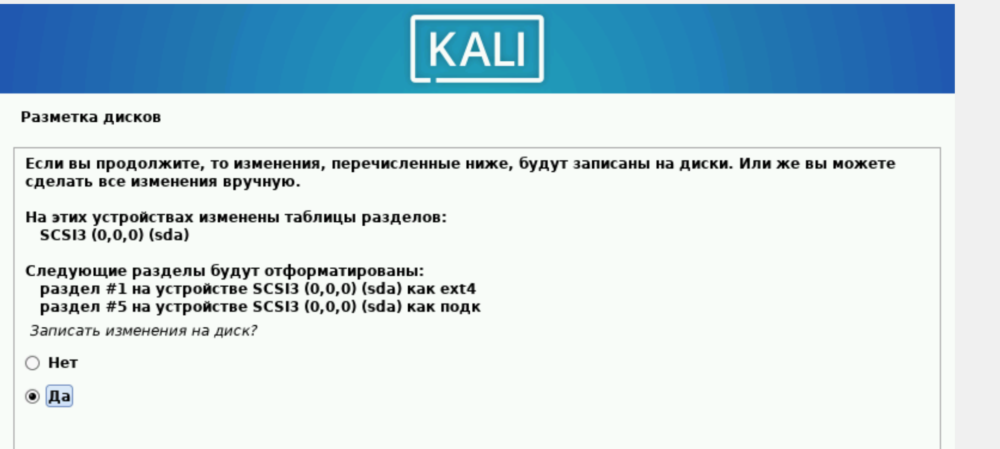{#fig:017 width=70%}

Далее я могу выбрать, какие метапакеты (пустые пакеты, которые
только описывают зависимости) я хотите установить. Выбор по
умолчанию установит стандартную систему Kali Linux, поэтому я не хочу
менять выбор (рис. 18).

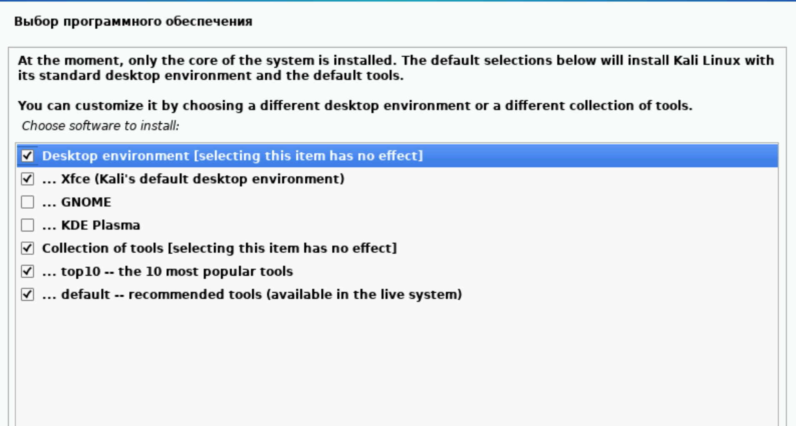{#fig:018 width=70%}

Подтверждаю установку системного загрузчика GRUB (Загрузчик
операционной системы от проекта GNU программа для управления
процессом загрузки), также выбираю виртуальный диск, на который
устанавливать GRUB  (рис. 19).

{#fig:019 width=70%}

Завершаю установку.

Проверяю, что в носителях теперь пусто (рис. 20).

{#fig:020 width=70%}

Вхожу в систему от имени своего пользователя (рис. 21).

{#fig:021 width=70%}

Это успех!

# Выводы

Приобрела практические навыки по установке операционной системы Linux на виртуальную машину. Установила дистрибутив Kali LInux на VirtualBox.

# Список литературы. Библиография.

[1] [Официальная документация по устновке Kali Linux на VirtualBox](https://www.kali.org/docs/virtualization/install-virtualbox-guest-vm/)
