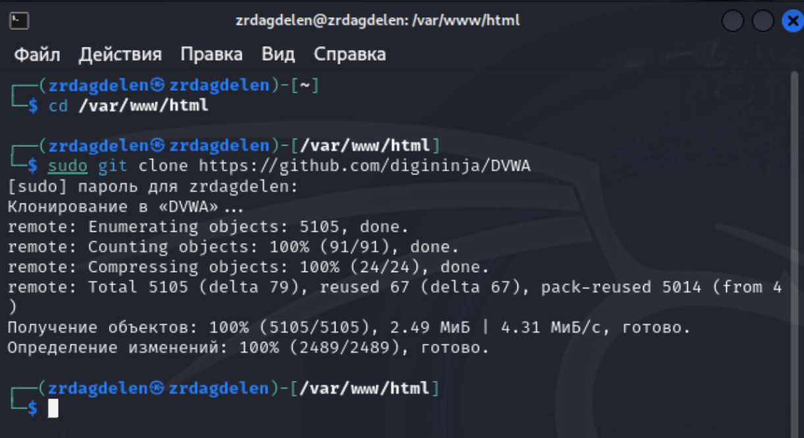
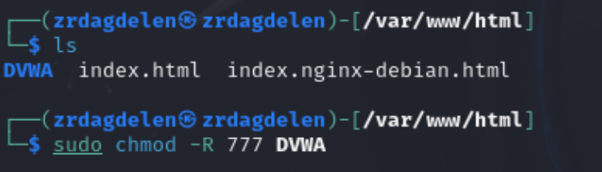
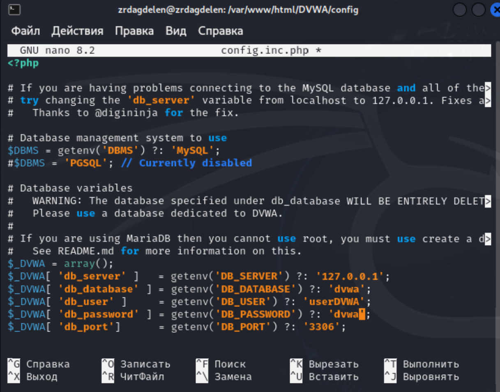
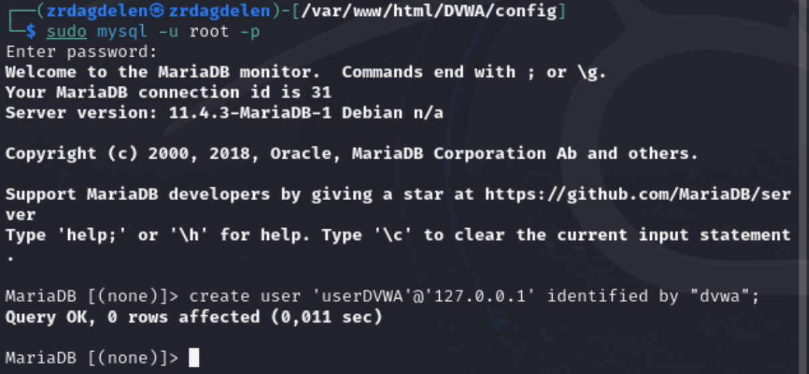
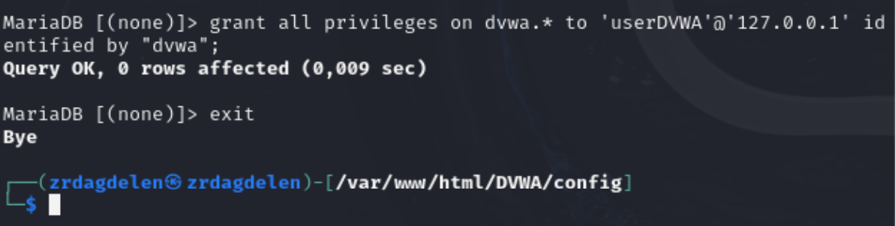
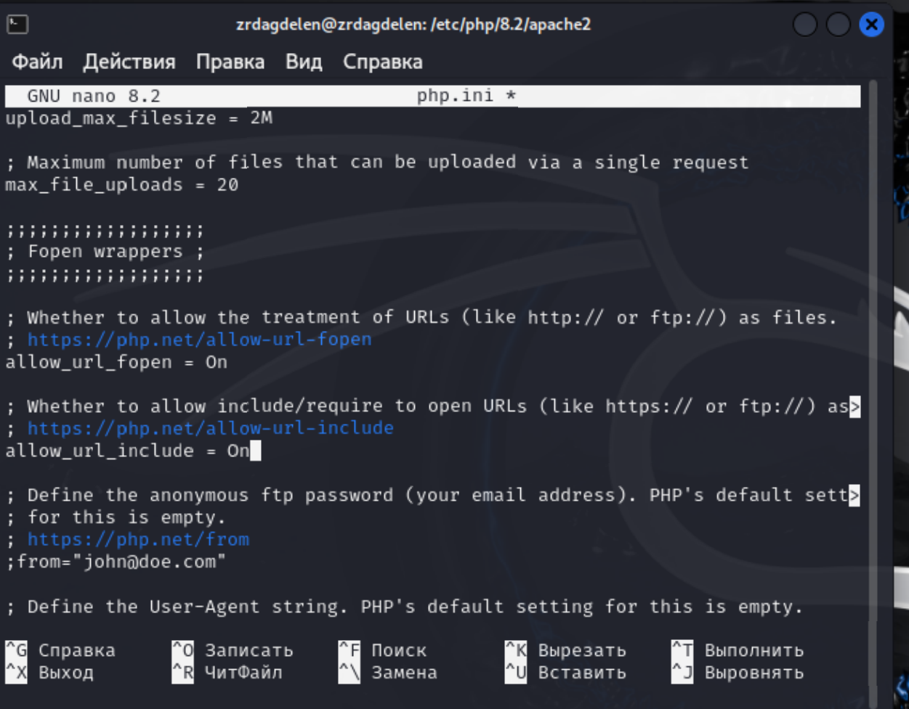
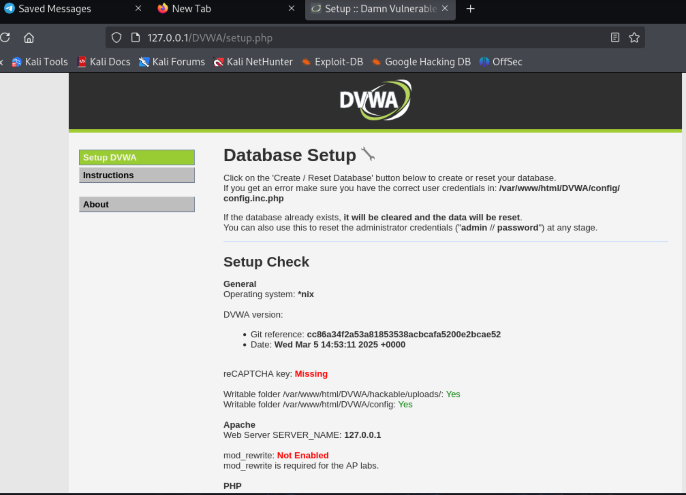
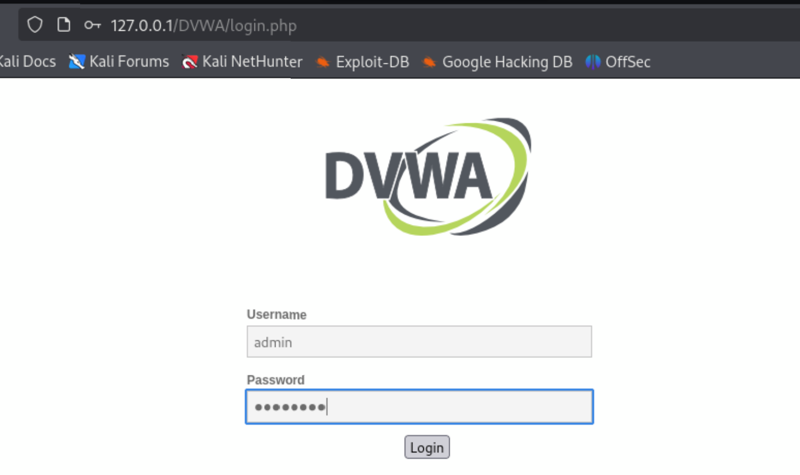
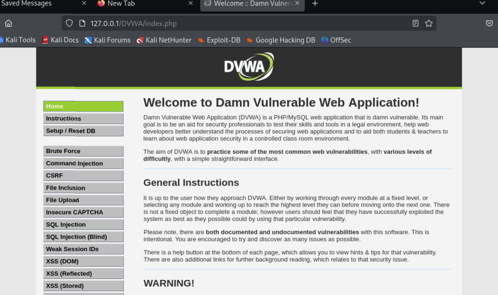

---
## Front matter
lang: ru-RU
title: Индивидуальный проект. Этап 2.
subtitle: Установка DVWA
author:
  - Дагделен З. Р.
institute:
  - Российский университет дружбы народов, Москва, Россия
  
date: 17 марта 2025

## i18n babel
babel-lang: russian
babel-otherlangs: english

## Formatting pdf
toc: false
toc-title: Содержание
slide_level: 2
aspectratio: 169
section-titles: true
theme: metropolis
header-includes:
 - \metroset{progressbar=frametitle,sectionpage=progressbar,numbering=fraction}
 - '\makeatletter'
 - '\beamer@ignorenonframefalse'
 - '\makeatother'
---

## Докладчик

:::::::::::::: {.columns align=center}
::: {.column width="70%"}

  * Дагделен Зейнап Реджеповна
  * студентка из группы НКАбд-02-23
  * Факультет физико-математических и естественных наук
  * Российский университет дружбы народов
  * [1132236052@rudn.ru](mailto:1132236052@pfur.ru)

:::
::: {.column width="50%"}

:::
::::::::::::::

# Цель

Приобретение практических навыков по установке DVWA.

# Выполнение лабораторной работы

## 1.1

Настройка DVWA происходит на нашем локальном хосте, поэтому нужно перейти в директорию `/var/www/html`. Затем клонирую нужный репозиторий GitHub

{#fig:001 width=70%}

## 1.2

Повышаю права доступа к этой папке до 777

{#fig:002 width=70%}

## 1.3

Чтобы настроить DVWA, нужно перейти в каталог `/dvwa/config` 

{#fig:003 width=70%}

## 1.4

Создаем копию файла, используемого для настройки DVWA `config.inc.php.dist` с именем `config.inc.php`.

{#fig:004 width=70%}

## 1.5

Изменяю данные об имени пользователя и пароле

{#fig:006 width=70%}

## 2.1

Запускаю mysql

{#fig:007 width=70%}

## 2.2

Авторизируюсь в базе данных от имени пользователя root. Создаем нового пользователя, используя учетные данные из файла config.inc.php

{#fig:008 width=70%}

## 2.3

Теперь нужно пользователю предоставить привилегии для работы с этой базой данных

{#fig:009 width=70%}

## 3.1

Необходимо настроить сервер apache2, перехожу в соответствующую директорию

{#fig:010 width=70%}

## 3.2

В файле параметры allow_url_fopen и allow_url_include должны быть поставлены как `On` 

{#fig:012 width=70%}

## 3.3

Запускаем службу веб-сервера apache и проверяем, запущена ли служба 

{#fig:013 width=70%}

## 4.1

Мы настроили DVWA, Apache и базу данных, поэтому открываем браузер и запускаем веб-приложение, введя 127.0.0/DVWA 

{#fig:014 width=70%}

## 4.2

Авторизуюсь с помощью предложенных по умолчанию данных 

{#fig:015 width=70%}

## 4.4

Оказываюсь на домaшней странице веб-приложения, на этом установка окончена 

{#fig:016 width=70%}

## Вывод

Приобрела практические навыки по установке уязвимого веб-приложения DVWA.

:::
